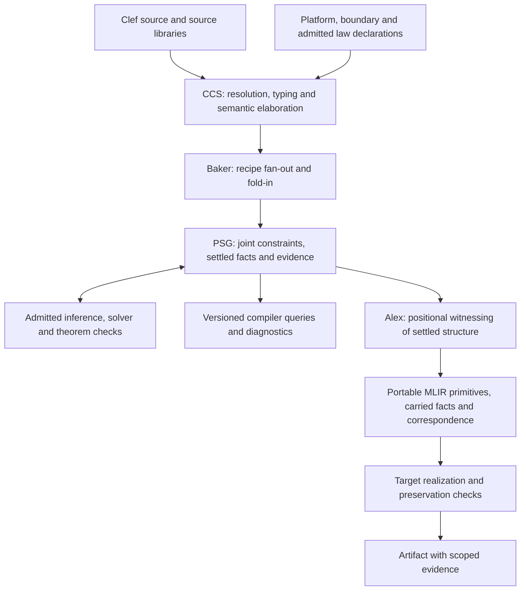

# Clef language completion: design and architecture analysis

2026-09-13. Design analysis for the language work coordinated in Composer.

**2026-09-19 review:** The [roadmap reconciliation and evidence record](Clef_Language_Completion_Review_2026-09-19.md)
adds the requested negative/fractional admission and standard-MLIR-dialect scope,
full-document supersession findings and fresh implementation checks. Composer
remains the canonical implementation roadmap; §14 supplies the dependency
baseline, with completion and coverage governing revisions to order or design.
The [coverage waypoints](Language_Coverage_Waypoints.md) record synchronized
compiler, tooling and oracle revisions, their actual gates and remaining gaps.
New lettered FidelityHello variants are part of that coverage. Semantic changes honor Baker's ingredients/patterns/recipes and
nanopass fan-out/fold-in elaboration and saturation, with Alex's positional Huet
zipper and pull witnesses consuming the settled graph. Imperative emission
and recursive subtree emitters are not implementation alternatives. The original scope and
unmeasured status below describe the September 13 analysis. The subsequent
[nanopass and incremental contract direction](Nanopass_Incremental_Contract_Direction.md)
records the topological recompilation frontier, provenance/retraction, Lattice
explanations and extensible witness requirements. Its formal protocol remains
deferred while the pipeline develops.

This analysis concerns Clef expression, CCS elaboration and saturation, PSG joint resolution, automatic proof dispatch, and the contract Composer and Alex must consume. It uses the language specification, Clef and Composer design documents, and the Clef site's design writings. WrenHello supplies a documented application example. Preprints and the negative/fractional-type extension are excluded. Concurrent platform and client projects are context, not work assigned by this plan.

No implementation source was inspected for this analysis. No compiler behavior was freshly measured. Dated implementation reports are evidence of their recorded slices, not a substitute for the design and not a claim about the present checkout. This document adds an analysis; it does not amend language semantics or supersede its cited sources.

The companion [workload frame](Clef_Language_Completion_Workload_Frame.md) develops the subsequent review of recent parallelism and storage writings, BAREWire, Fidelity.Platform's MCU/MMIO expansion, and MBS/NSS. It supplies concrete functional, resource, concurrency and preservation acceptance cases for the sequence below. Type, dimensional and constraint information remains available through PSG, MLIR and backend decisions for as long as it is useful, including numeric selection, narrowing and memory layout. Final untagged BAREWire layout follows that preservation discipline; JavaScript/Cloudflare bridges may retain host dictionary or tagged representations under their declared target contracts.

**1. What completing the language means**

Clef completion is agreement between source semantics, their graph expression, and the behavior of each claimed realization. Successful parsing or a working isolated example is insufficient. A feature must compose with functions, data, lifetime, effects, target declarations, and the evidence required at its uses. The specification already defines this completion discipline: the specification, implementation, and conformance expectation must agree. [Change process](../../clef-lang-spec/spec/change-process-management.md), [conformance](../../clef-lang-spec/spec/conformance.md).

The language's remit includes ordinary functional expression and inference; native numeric and dimensional meaning; deterministic memory and access; deferred and reactive computation; concurrency and coordination; foreign and platform boundaries; and preservation of their required properties through compilation. These responsibilities meet at the PSG. The standard library in its entirety is outside the specification's scope, but specified intrinsics and the semantic contracts of the included collection and computation families are inside it. Completing Clef therefore requires an explicit supported library surface rather than inheriting all of FSharp.Core by implication. [Scope](../../clef-lang-spec/spec/scope.md).

The central architectural consequence is that increasing language expression increases the semantic work above the witness boundary. A new functional primitive is complete when CCS can elaborate it into the shared graph vocabulary, resolve its relationships, generate its applicable obligations, and expose settled consequences to consumers. Adding a backend recognizer for the primitive does not fulfill that contract.

**2. The governing design and how to read its evolution**

The normative specification governs language behavior. Its conformance chapter explicitly distinguishes requirements from examples and lineage: an inherited example cannot authorize behavior a normative clause prohibits. Clef's `docs/fidelity/phg/` is the compiler design of record. Composer's thin-middle-end doctrine and its companion designs establish the orchestration and witness discipline. The supersession register identifies retired mechanisms and the clauses that replace them. [CCS design entry point](../../clef/docs/fidelity/README.md), [supersession register](../../clef/docs/fidelity/phg/Design_Supersession_Register.md), [thin middle end](Thin_Middle_End_Design.md).

Several documents deliberately retain historical measurements, intermediate mechanisms, and research alternatives. Their continued presence is not a reason to reopen the settled architecture. In particular:

| Earlier account | Governing direction for this work |
|---|---|
| FCS typed-tree correlation and semantic elaboration in Composer | CCS constructs and saturates the semantic graph; Composer consumes its facts. |
| Composer computes layout, escape, curry, and semantic coeffects before emission | These program facts belong in CCS; the recorded PSGElaboration lift is the architectural baseline. |
| Packed closure words, a code pointer in the environment, and deferred casts | The interior closure uses the portable function/environment contract; its form and layout settle in the graph. |
| A seq recognizer or backend splitting pass | Baker establishes segments, states, liveness, and slots on the graph. |
| DCont and Inet semantic dialects in the middle end | Suspension and net structure reside in the graph; the witness emits the settled decomposition. |
| Proofs enabled by an application annotation or editor action | Supported language and admitted-library obligations are derived and dispatched automatically. |
| Source width names and a machine-word default | Numeric kind and dimension are source identity; justified ranges and platform declarations determine representation. |

These resolutions are recorded in the [dimensional handoff](../../clef/docs/fidelity/phg/Dimensional_Handoff.md), [NTU specification](../../clef-lang-spec/spec/ntu-types.md), [backend specification](../../clef-lang-spec/spec/backend-lowering-architecture.md), [continuation specification](../../clef-lang-spec/spec/dcont-representation.md), and [conformance §6.1](../../clef-lang-spec/spec/conformance.md).

The Single Flattening and Obligation Residency documents describe themselves as non-normative directions of record. Their design remains central here without converting every explanatory assertion into an established theorem or implementation milestone. The normative chapters now adopt important parts of that direction, including graph-resident suspension and the emission-transport boundary. [Single flattening](Single_Flattening_Design.md), [obligation residency](Obligation_Residency_Design.md).

**3. Ownership through the pipeline**

CCS owns source identity, type and measure inference, resolved operations, elaboration, range and capability judgments, lifetime and layout facts, and supported obligations. Platform declarations are inputs to this reasoning. Target awareness in CCS is therefore necessary for settlement; it does not make CCS a target-code emitter. [CCS architecture](CCS_Architecture.md), [dimensional range design](../../clef/docs/fidelity/phg/Dimensional_Range_Design.md).

Baker supplies the compositional construction mechanism. Ingredients provide structural vocabulary, patterns compose it, and recipes fan out a source construct into semantic structure. Fold-in integrates that structure and its consequences. A recipe extension must carry its origin and applicable obligations with the structure it introduces. It must use the established construction mechanism instead of creating a parallel semantic implementation in a witness. [Baker saturation architecture](../../clef/docs/fidelity/Baker_Saturation_Architecture.md), [PSG enrichment](PSG_Enrichment_Architecture.md).

Composer owns orchestration: project checking, chosen compiler and platform inputs, proof-service execution, witnessing, backend invocation, artifact production, and the checks that connect those stages. Keeping the work coordinated in Composer is appropriate because this is where the end-to-end contract becomes observable. That coordination does not transfer semantic ownership out of CCS.

Alex uses positional traversal and compositional patterns to realize settled facts. It must report a missing fact where the fact is required. It must not infer an absent width, choose a closure lifetime, reconstruct suspension liveness, synthesize a source-level forwarding body, or invent an observable boundary constant. Emission bookkeeping, including deterministic value names, is distinct from semantic analysis; the later CCS account expressly distinguishes that naming from older claims of universal preassigned SSA coeffects. [Alex architecture](Alex_Architecture_Overview.md), [CCS architecture](CCS_Architecture.md).

Target pathways realize portable carriers under the chosen substrate. A native pathway uses settled layout and lifetime facts; the JavaScript pathway can realize the same structural contract using host functions and objects. The backend specification permits reading carried type structure for carrier realization. This does not authorize the emission traversal to query hyperedges or perform joint reasoning again. [Backend lowering §4.5](../../clef-lang-spec/spec/backend-lowering-architecture.md), [program hypergraph §5](../../clef-lang-spec/spec/program-hypergraph.md).

**4. What the PSG must retain as expression grows**

The PSG is the common semantic object, with hyperedges expressing relationships whose full participant set matters. The PHG generalization is an enrichment of that object, not another intermediate language that discards the PSG and its provenance. Binary relationships embed in the hypergraph discipline. [Program semantic graph](../../clef-lang-spec/spec/program-semantic-graph.md), [program hypergraph](../../clef-lang-spec/spec/program-hypergraph.md).

For each construct, the graph must retain enough information to answer the following questions before its consumer commits:

| Concern | Information required |
|---|---|
| Source identity | Which declaration, binding, use, capture occurrence, and source span this is; which generated structure originated here. |
| Function application | Callable identity where known, argument order, supplied arguments, residual arity and type, effects of evaluation, and direct or materialized form. |
| Type and dimension | Resolved nominal/structural identity, kinded parameters, substitutions, generic instantiation, and dimensional equations. |
| Data and storage | Aggregate fields and cases, initialization, sharing, mutability, access capability, layout context, and governed storage. |
| Resources | Lifetime requirements, available regions, escape, release/retirement, bounds, and target capability premises. |
| Deferred execution | Dependencies, demand, state transitions, suspension cuts, delimiters, live-across values, and delivery relationships. |
| Joint relationships | Complete participants and their semantic roles in placement, transfer, waits, reduction, and proof composition. |
| Evidence | Proposition, premises, checking mechanism, current result, source/target context, and dependencies that invalidate it. |

An ordinary dependency set does not substitute for the source argument list or a net's port roles. The plan must preserve existing ordered child/frontier structure alongside relation membership. For example, applying a function twice to the same value still has two argument positions, and a capture has a position in each environment that captures it. These are adequacy cases for the graph contract, not a proposal to replace its defined representation.

Joint resolution matters because local facts constrain one another. A capture's value range can affect its representation; representation affects the environment layout; environment placement must satisfy its lifetime and target capacity; a transfer theorem needs those same values, storage identities, and boundaries. Independently successful checks about different participants do not establish the joint program property.

The specification requires complete enumerated source sets at hyperedge elaboration, joint firing, monotone terminating saturation, and diagnosis of undischargeable active constraints. It also requires separate solver-family projections. The implementation plan must state each extension's dependencies and admitted analysis domain so those requirements remain meaningful as recipes add structure. A new recipe does not inherit arbitrary termination, runtime normalization, or proof-search guarantees merely from being inserted into the saturation engine. [Program hypergraph §§1–4](../../clef-lang-spec/spec/program-hypergraph.md), [conformance §6.1](../../clef-lang-spec/spec/conformance.md).

Separate solver-family projections do not authorize pairwise weakening of the participant relation. Each projection must remain attached to the original joint obligation and its actual participants. Combining the results requires the admitted composition rule and all of its premises. For example, field extent, region lifetime, and capacity checks can use different reasoning procedures while still describing one particular environment in one particular placement context. Three successful checks about unrelated environments establish no such result.

Emission consumes the consequences: settled node-local codata or deliberately reified annotations with a named downstream consumer. The witness never reconstructs the joint relation. Layout construction and extraction must consume the same placements, and a placement must identify its aggregate context; the same source binding can occupy different slots in different environments. [Layout as a joint constraint](../../clef/docs/fidelity/phg/Layout_As_Joint_Constraint.md), [information accrual](../../clef-lang-site/hugo/content/docs/design/structure-and-performance/information-is-not-discarded.md).

**5. Functional primitives: the first semantic foundation**

The immediate language work is a compositional functional core. Application, binding, pattern elimination, recursion, and polymorphism must be reliable together before advanced computation families can rely on them.

Application has three related outcomes. A fully supplied known call can become a direct call. A local partial application can be absorbed into a later saturation when doing so preserves evaluation. A residual function that escapes must remain a first-class callable value. The residual function's type, supplied arguments, original captures, and evaluation history must survive. A missing runtime result cannot be represented as an empty witness merely because a local optimization once permitted that treatment. [Currying and lambdas](PRDs/F-04-CurryingLambdas.md), [partial-application analysis](Partial_Application_Closure_Reification.md).

The architecture determines where any reification belongs. If a forwarding body is required, Baker establishes that body and its captures on the graph. Alex then witnesses an ordinary settled function form. The older partial-application document contains alternatives that place semantic synthesis in Alex; the current ownership doctrine resolves that placement without asking for a new policy decision.

Recursion must follow Clef's own source rules. Current module semantics remove the requirement for `let rec`, `and` groups, recursive module syntax, and developer-managed source ordering. Dependency analysis and strongly connected components establish recursive groups. Older PRD examples remain useful behavioral cases, but their spelling must follow the current language contract. [Program structure](../../clef-lang-spec/spec/program-structure.md), [namespaces and modules](../../clef-lang-spec/spec/namespaces-and-modules.md).

Polymorphism must survive these elaborations. Fresh uses of a generalized function receive the appropriate instantiation; variables shared with the environment remain shared. Type and measure parameters retain kind and declaration identity through capture and specialization. A memoized or immutable value that contains mutable storage cannot gain independently incompatible instantiations merely because the outer binding is immutable. [Inference and constraint solving](../../clef-lang-spec/spec/inference-constraint-solving.md), [type representation](../../clef-lang-spec/spec/type-representation-architecture.md).

Patterns and data are part of the same foundation. Every constructor, eliminator, guard, binding, update, and failure path needs a graph meaning. Nested union patterns, records containing unions, unions containing closures, functions returning aggregates, and patterns inside deferred computations must compose. Decision-tree construction must preserve source evaluation and binding scope. Equality, comparison, and hashing used by collections or incremental cutoff require their declared semantics; they cannot fall back to an object runtime.

The minimum functional acceptance set should include the following behavioral combinations:

- Saturated, partial, nested-partial, tupled, curried, higher-order, and function-returning applications.
- Supplied arguments with observable effects, evaluated once at the required point even when the resulting function is unused or invoked repeatedly.
- Capturing named declarations and anonymous lambdas; recursive functions used directly and as values.
- Function values selected by a branch, captured by another function, or stored in records, unions, and collections, retaining both captures and code identity.
- Multiple closures sharing one mutable cell; separate factory invocations retaining independent state; aliases preserving the required snapshot behavior.
- Generic functions used at several type and measure instantiations, including nested record/union payloads and shadowed declarations.
- Nested patterns, guarded alternatives, empty and singleton cases, and failures with located diagnostics rather than malformed downstream output.

These cases turn the existing semantic requirements into a reviewable completion bar. They do not prescribe a new backend representation.

**6. The environment family is the bridge to higher-order computation**

The design's general object is the environment: ordered captured fields, code reference, escape relationship, and release relationship. Closure environments, continuation frames, and actor state cells share that foundation. The form family is selected at saturation; vacant and unmaterialized forms can disappear, while materialized forms carry the required lifetime, field, and boundary refinements. [C-01 §14](PRDs/C-01-Closures.md), [closure architecture](Closure_Nanopass_Architecture.md).

The normative closure contract is precise about what must survive:

- The environment is flat rather than a chain of enclosing environments.
- Immutable captures copy values and preserve any sharing those values contain.
- Mutable captures refer to shared storage that outlives every user.
- Placement follows scope, region, program-lifetime, or dynamic requirements and the storage the target actually supplies.
- Every field is initialized and absence is represented explicitly.
- The code identity and environment remain a coherent callable value through passing, returning, aggregate storage, and invocation.
- Layout and form settle before witnessing; the interior does not reintroduce address packing or deferred closure casts.

[Closure representation §§2–6 and §§8–11](../../clef-lang-spec/spec/closure-representation.md).

Stored closures are a required part of the language contract. The current backend and union chapters require the settled form to preserve code identity and the eliminator to produce the callable pair. The implementation treatment must be evaluated against the full storage and invocation cases above, including different implementations with identical capture layouts. The requirement fixes semantic ownership and observable behavior; establishing the adequacy of a concrete implementation remains engineering work under that contract. [Backend §4.2](../../clef-lang-spec/spec/backend-lowering-architecture.md), [union representation §9.1](../../clef-lang-spec/spec/discriminated-union-representation.md), [Gaining Closure](../../clef-lang-site/hugo/content/docs/design/memory/gaining-closure.md), [retooling plan](../../clef/docs/fidelity/phg/Closure_Retooling_Plan.md).

The direct verification obligations are extent, field separation and coverage, lifetime ordering, release, and application agreement. These are useful because they refer to concrete graph participants. The current specification also limits the finiteness argument: a finite capture list produces finite direct slot obligations; it does not bound every object reachable through captured references or establish ownership of that storage. A byte copy likewise requires reference validity, sharing, representation compatibility, and code availability at the destination. [Closure §5 and §11](../../clef-lang-spec/spec/closure-representation.md).

That distinction matters for every extension. A continuation can carry a reference, a lazy value can produce shared mutable storage, and an actor can retain a callback. The environment's layout proof is one part of their safety argument. It must compose with the referent's lifetime and access facts rather than silently stand in for them.

A concrete acceptance trace makes the ownership testable. Consider a factory whose result is a partially applied function: the supplied argument has an observable evaluation, and the original function captures mutable state. The result is stored in a union and invoked after the factory returns. CCS must preserve the supplied argument's evaluation point, identify the shared cell and residual function type, and resolve the union's construction and elimination. Baker must materialize any required residual body and capture structure. Joint settlement must establish the environment form, its instantiated field layout, callable identity, storage lifetime, and release relationship. The closure obligations refer to those exact participants. Alex witnesses that settled construction, elimination, and call. Acceptance compares the observable argument evaluation and state updates, then checks that the artifact's accesses and callable correspondence agree with the settled facts. Separate factory instances and two different implementations with the same capture layout extend the same test. This is a derived acceptance scenario, not an additional language rule.

**7. Collections, lazy values, sequences, and reactive computation**

Collections need construction, elimination, traversal, and persistence contracts over the functional core. Each higher-order operation must state argument evaluation, ordering, short-circuiting, empty-input behavior, failure, and storage requirements. Fusion or reassociation is permitted only under the operation's established laws and effects. A numeric fold, for example, also needs the arithmetic contract for every reachable intermediate and merge.

Lazy and seq extend the environment with slot classes. Lazy introduces demand and, for the memoizing form, state publication and cached-result fields. Seq introduces discriminant, current value, captures, and internal state. Their transition rules belong to the graph rather than independent recognizers in Alex. [Closure family §7](../../clef-lang-spec/spec/closure-representation.md), [lazy representation](../../clef-lang-spec/spec/lazy-representation.md), [seq representation](../../clef-lang-spec/spec/seq-representation.md).

The lazy chapter retains an initial pure-thunk stage and a memoizing extension; the incremental chapter describes the cached form. The completion work must make the implemented stage and its observable behavior explicit in the conformance cases. It must not silently change repeated-force behavior while calling the change a layout optimization. The memoizing form's single-forcer, visibility, failure, and cleanup obligations must be instantiated from its transition discipline. Historical staging is documentation to reconcile, not permission to introduce an alternative lazy semantics in the backend.

Seq is the immediate structural bridge to general suspension. Its current specification requires segments at yield points in graph evaluation order, with liveness and state settled before witnessing. Acceptance needs effects before and after a yield, loops spanning yields, branches, nested bindings, exhaustion, repeated enumeration, and storage that survives precisely as long as the iterator requires. The triangular-number and Fibonacci examples in the seq chapter are already useful specifications of resumed-local behavior.

Reactive and incremental computation then reuse the same function and dependency facts:

| Family | Semantic obligation |
|---|---|
| Observable | Deliver emissions under the subscription contract; no implicit equality cutoff, dropping, or reordering. |
| Incremental | Demand-driven stabilization and valid cutoff over the actual dependencies; preserve persistent and dynamic graph relationships. |
| Signal/Memo/Effect | Expose the reactive surface over those primitives, including batch boundaries and effect cleanup. |
| Dynamic bind | Attach and retire the selected dependency subgraph without stale dependencies or invalid lifetime reuse. |

[Observable computation](../../clef-lang-spec/spec/observable-computation.md), [incremental computation](../../clef-lang-spec/spec/incremental-computation.md), [reactive signals](../../clef-lang-spec/spec/reactive-signals.md), [incremental PRDs](PRDs/R-04-IncrementalFoundations.md).

An unchanged reference address does not prove an unchanged input when the referent is mutable. Capture/dependency analysis must preserve that distinction for cutoff and deferred range evidence. Subscription disposal and effect retirement are observable lifecycle events even on a host that manages memory automatically.

**8. Delimited continuations are graph-resident suspension**

The continuation design is already established. The compiler does not need a new semantic MLIR dialect to express `async`, actor receive, synchronous reply waits, or completion-driven handoff. A builder extent supplies the delimiter; cuts divide the computation into segments; the frame carries the delimited remainder. [Continuation specification](../../clef-lang-spec/spec/dcont-representation.md), [Composer continuation design](Delimited_Continuations_Architecture.md).

The recipe performs these semantic steps:

1. Establish the builder extent and the source evaluation structure inside it.
2. Associate every suspension cut with its delimiter.
3. Establish resume segments and the live-across set for each cut.
4. Retain internal state and the type of each delivered or yielded value.
5. Settle the discriminant, interference-compatible slots, layout, and placement.
6. Attach the resumption relation: I/O, mailbox, interrupt, or DMA completion as specified.
7. Derive and discharge the applicable frame, access, dominance, and use obligations.
8. Expose the settled form for witnessing.

For N cuts, the stated state family has N+2 values: initial, the suspension states, and completion. The witness emits the discriminant, frame accesses, function values, and `scf.index_switch`. CPU realization executes that form; a target with native suspension machinery may realize it below the boundary. The JSIR profile realizes the same source structure through host suspendable functions and event-loop delivery. These are carrier realizations, not independent source semantics.

The verification conditions already named in the design are VC-EXT, VC-STATE, VC-ACC, VC-DOM, and VC-ONE. Completing their application requires the following interactions to be covered explicitly by the graph and conformance cases:

- Genuine delayed delivery, not only an immediately completed nested computation.
- Nested delimiters, multiple active invocations, loops and branches across cuts, and differing delivery types.
- Shared mutable captures and live storage whose defining scope has returned.
- Normal completion, cancellation, timeout, failure, and retirement under the corresponding error and scheduler contracts.
- Duplicate or late delivery and the continuation's linear use discipline.
- Declared multi-shot use with the inherited transfer and resource obligations of copied captures.

The specification's exactly-once frame obligation and the scheduler's progress conditions must be interpreted together. A single syntactic resume site does not establish that an external operation eventually delivers. Conversely, a timeout or failure path cannot silently leak the frame or resume it again after retirement. These are integration obligations for the designed coordination model. The error chapter explicitly records continuation/async/error integration among its remaining specification work. [Error handling](../../clef-lang-spec/spec/error-handling.md), [scheduler contract](../../clef-lang-spec/spec/scheduler-contract.md).

The existing Composer design selects the CPU state-machine form first. Awareness that another project may deliver a web client first does not, by itself, change that compiler sequence or make the existing Fable client pathway evidence of Clef JSIR completion. The source contract should be common, and each claimed substrate must establish its realization separately.

**9. Interaction-net resolution belongs in the PSG**

The intended regional distinction is based on effects and dependency shape. Sequential dependency uses suspension structure; dense regular independent work has its structured parallel realization; irregular independent reduction is the interaction-net case. A computation-expression name can suggest a form but cannot prove the region's independence. [DCont/Inet design](../../clef-lang-site/hugo/content/docs/design/concurrency/dcont-inet-duality.md), [graph-direct parallelism](../../clef-lang-site/hugo/content/docs/design/concurrency/graph-direct-parallelism.md).

The single-flattening design gives two graph-resident outcomes. A statically reducible net can normalize during saturation and leave ordinary settled computation. Dynamic irregular reduction leaves typed cell data, compiled rule functions, and a driver. The CPU driver is a worklist realization; spatial or parallel targets realize the same admitted reduction semantics under their own resource and execution contracts. No intermediate language-semantic Inet dialect is needed above the witness boundary. [Single flattening §3](Single_Flattening_Design.md).

The completion work must instantiate that design as a reviewable contract for the admitted net fragment:

| Contract | Required content |
|---|---|
| Source correspondence | Which pure/reduction region is represented and what result and termination observations must be preserved. |
| Net structure | Agent kinds, principal and auxiliary ports, active pairs, rule bodies, and explicit sharing/duplication/disposal roles. |
| Graph residency | Recipe construction, reduction consequences, retained source provenance, and the active projection observed after rewriting. |
| Rule admissibility | The confluence or permitted-interaction argument for the actual admitted rules. |
| Runtime resources | Cell representation, population growth, allocation/reclamation, capacity policy, and failure behavior. |
| Parallel realization | Exclusive claiming, permitted concurrent rewrites, publication, and completion under the selected substrate. |
| Effect crossing | The result and storage handoff back to an effectful or suspended region. |

The supersession register already records a direction for annihilation: retain the agents' structural record and add the reduction's rewiring consequences rather than hard-deleting the information required by the semantic graph. That direction must be instantiated consistently with the graph lifecycle and active/reduced projection. [Annihilation waypoint](../../clef/docs/fidelity/phg/Design_Supersession_Register.md).

There are three distinct correctness questions. Compiler saturation must terminate under its admitted analysis rules. The net's rewrite system must satisfy its declared reduction laws. A concrete parallel driver must realize those laws without races or invalid resource reuse. None substitutes for the others. Likewise, a literal cell layout does not bound the runtime cell population. The site design itself separates rule-system confluence from per-program placement, resource, and non-interference obligations; the implementation plan must keep those obligations separate while retaining their shared participants.

The first net exercise should therefore be a small admitted pure reduction with inspectable graph structure, including independent active pairs, sharing where permitted, erasure, and return into an ordinary function or continuation. Static disappearance and dynamic execution both need coverage. Equivalent output across selected schedules is a useful regression; the admissibility and preservation arguments remain part of the design's proof contract.

**10. Automatic proof dispatch is part of language completion**

Proof obligations are generated with the semantic structure they constrain. They are graph citizens with participant identities and provenance, not a second interpretation maintained by a harness or editor. For a supported operation or admitted library law, the application developer does not restate the rule or choose a theorem merely to activate required checking. [Obligation residency](Obligation_Residency_Design.md), [conformance §6.1](../../clef-lang-spec/spec/conformance.md).

The current proof-composition design organizes obligations into structural inference, supported local analysis/solver conditions, parameterized domain/system theorems, and relational judgments. This is an organization of evidence, not a mandatory four-step search and not a declaration that one tier has a universally fixed trusted base. Composer orchestrates the selected checking services; the obligation's logic and admitted rule determine dispatch. [Proof composition architecture](Proof_Composition_Architecture.md).

Cross-application of proofs requires a concrete evidence contract:

| Evidence component | Why it is needed |
|---|---|
| Proposition and observation | Defines what was actually established. |
| Participant and parameter identities | Prevents a proof about one value, buffer, region, or operation being used for another. |
| Source and target context | Binds the result to the checked program and realization. |
| Premises and their evidence | Preserves the conditional nature of library and platform claims. |
| Law and semantic mapping | Justifies importing the result into the receiving judgment. |
| Resource discipline | Prevents duplication or disposal of ownership evidence where the judgment forbids it. |
| Accepted checking justification | Distinguishes a checked derivation, a solver-dependent verdict, and an unchecked assertion. |
| Dependency and freshness information | Invalidates results when relevant sources, laws, encodings, premises, or target facts change. |

A quotation carries a proposition or declaration for compiler processing; it does not prove it. An `unsat` result establishes the encoded obligation under its premises; matching anchor names do not prove that the encoding describes the emitted operations. A theorem imported from another checking system needs an accepted correspondence and its transitive assumptions. These are already normative requirements, not optional enhancements to the proof display.

The distributed numerical join in the proof-composition architecture is a useful eventual exercise because it forces several facts to meet: input partition and version identity; local arithmetic and exact merge; buffer ownership and lifetime; accepted-result identity; and recovery premises. The lesson for current functional work is immediate: closure, range, layout, and protocol evidence must identify the same participants. The application example is a validation shape, not an instruction to take over a concurrent platform project.

Procedure domains and failure states must remain honest. Structural inference, conservative analysis, supported solver queries, certificate checking, and theorem discovery are different tasks. Unsupported rules, pending premises, timeout, contradiction, and invalid evidence must remain distinguishable. At a commitment boundary, an unestablished required property produces the specified diagnostic. The editor and command-line build must agree on the required checks; hiding a proof view cannot disable them. [Conformance](../../clef-lang-spec/spec/conformance.md), [Lattice consumer contract](../../clef/docs/fidelity/phg/Lattice_Consumer_Contract.md).

The engineering design places a managed OPAM/Rocq toolchain alongside cvc5 under Composer's orchestration. Toolchain preparation pins and checks package and adapter compatibility; interactive checking uses already-registered rules with bounded work. The design names Iris, Actris, Aneris, Verdi, and Clutch as candidate foundations with different judgments and execution models. They are not interchangeable, and their presence in the design does not establish an integrated or tested toolchain. A Rocq-founded domain theorem retains that foundation even when its local arithmetic premises are checked by cvc5. [Proof-service design and engineering gates](Proof_Composition_Architecture.md).

The initial service slice therefore needs a declared proof profile, one admitted semantic adapter, one supported certificate or derivation-admission route, and an automatically generated application instance. Its negative cases include an altered proposition, mismatched participants, a missing premise, disallowed logical assumptions, and stale source or target evidence. Cancellation and budget exhaustion must preserve an unresolved result. The subsequent expansion is by admitted obligation family and checked correspondence, not by installing more provers and treating their success flags as mutually substitutable evidence.

**11. What MiddleEnd and Alex must witness**

The baseline executable vocabulary is `func`, `memref`, `arith`, `scf` and `index`, with operation/profile extensions governed by [Backend §2.1.1](../../clef-lang-spec/spec/backend-lowering-architecture.md#211-operation-and-pathway-admission) and [M-01](PRDs/M-01-DialectAdmission.md). Alex is target-aware: it chooses the admitted form from Baker-settled relationships and platform requirements, including `scf` or direct `cf` where appropriate. Numeric selection and arithmetic construction govern arith/math witnessing. Target-specific encoding stays at the declared backend realization boundary, and unrealized casts remain prohibited above it. The handoff retains the expression and every correlated graph/proof fact needed downstream. Verification artifacts remain distinct from executable vocabulary. [C-01 §14.5](PRDs/C-01-Closures.md).

| Settled graph fact | Witness responsibility |
|---|---|
| Direct application and complete signature | Emit the corresponding direct call. |
| Materialized callable and coherent environment | Emit the carried function/environment form and its invocation. |
| Aggregate layout and field/case identity | Emit construction and extraction using the same settled representation. |
| Numeric representation and consumer adaptation | Emit the selected operation and already-justified adaptation. |
| Lifetime placement and storage context | Emit the corresponding allocation or storage access. |
| Suspension frame and segments | Emit frame access, discriminant, and structured state dispatch. |
| Settled dynamic net residue | Emit its data/rule/driver decomposition under the admitted contract. |
| Boundary operation and declared assumptions | Emit the operation with its correspondence and required target realization information. |

Every observable artifact fact must have a declared origin in source, specification, or platform description. The newline, input-buffer extent, copy length, error transformation, and callback lifetime are all examples of semantic facts that cannot be invented during lowering. The obligation-residency audit explains why a build-time observable obligation without a graph-side origin is a detected semantic leak.

Preservation has two directions: required properties must survive, and the artifact must not acquire undeclared behavior. The initial artifact-side check should read the witnessed facts before transforms change them. Later transforms remain responsible for preserving or rechecking affected properties. A successful check immediately after witnessing is not a blanket certificate for optimization, linking, or the execution environment. [Obligation residency §§2–5](Obligation_Residency_Design.md), [conformance §6](../../clef-lang-spec/spec/conformance.md).

**12. The rest of the language remit must remain in the plan**

Functional and continuation work depends on more than function syntax. The following domains must have explicit coverage as the language reaches completion:

| Domain | Completion obligation |
|---|---|
| Grammar and naming | Current Clef grammar, indentation, operators, literal/interpolation rules, source dependency ordering, scopes, qualified identity, and located diagnostics. |
| Modules and signatures | Inline signatures, abstraction, accessibility, nominal identity, and recursive dependency treatment without inherited source-order requirements. |
| Program execution | Dependency-ordered observable initialization, the selected entry convention, module instantiation, exported-entry boundaries, and distinct interactive-session behavior. |
| Types and inference | HM and measure inference, kinded parameters, sound generalization, SRTP/member resolution, aggregate field substitution, and specialization. |
| Numeric meaning | One integer and one real kind with dimensions; justified range, representation coverage, exact intermediates, declared rounding, and target capabilities. |
| Data and patterns | Complete constructor/eliminator/update behavior, generic and recursive aggregates, structural operations, exhaustiveness, and failure. |
| Memory and access | Region/access identities, mutability, capture sharing, lifetime order, reset/disposal validity, and no fabricated allocation fallback. |
| Metaprogramming | Phase-distinct quotations and admitted declaration/law readers with preserved identity; no runtime reflection or arbitrary compile-time execution by implication. |
| Error and effect behavior | Result-oriented failures, panic/termination where specified, cleanup, deferred failure, foreign errors, and continuation/scheduler integration. |
| Concurrency | Actor/message identity, conversation and wait relationships, bounded admission, supervision, fairness premises, and atomic/memory-order realization. |
| Foreign boundaries | Typed handles, callbacks, retention and release, representation/encoding, nullable or fallible ingress, and explicit validation. |
| Profiles | Core requirements plus separately claimed JavaScript and freestanding requirements, with target-specific assumptions and artifact evidence. |

Program startup and exported invocation are observable parts of the language. The execution chapter distinguishes process entry, reset-vector entry, library exports, and JS module exports. JS initialization occurs once per module instantiation; a deployment can contain multiple instantiations. An implementation cannot turn those into one universal startup convention. The JS entry-surface declaration form is expressly recorded as remaining specification work. [Program structure and execution](../../clef-lang-spec/spec/program-structure-and-execution.md).

The numeric contract is especially relevant to functional primitives: a higher-order function must not erase dimensions or turn a missing range into a machine-word assumption. Collection folds and parallel reductions must carry intermediate and merge bounds. Real representation selection filters by coverage and the declared objective; an empty coverage set is a hard error under conformance. [NTU types](../../clef-lang-spec/spec/ntu-types.md), [width inference](../../clef-lang-spec/spec/width-inference.md), [numeric selection](../../clef-lang-spec/spec/numeric-selection.md), [rounding](../../clef-lang-spec/spec/rounding.md).

The memory chapter fixes region/access vocabulary and the lifetime-placement model while explicitly identifying further lifetime-ordering specification work. That work belongs with the shared environment and resource rules. It must not be improvised independently in closure, seq, actor, or FFI lowering. [Memory regions](../../clef-lang-spec/spec/memory-regions.md), [access kinds](../../clef-lang-spec/spec/access-kinds.md).

Platform predicates provide a documented concrete example of the same authority boundary. The current specification describes a closed, static device-access fragment: CCS establishes declaration relationships and access evidence; Composer consumes them. A quotation, a register's existence, or an architecture name does not establish workload permission or physical mapping. This fragment is useful evidence for the intended declaration-to-codata contract, while its own text excludes general capability dispatch and runtime mapping guards from the implemented claim. [Platform predicates](../../clef-lang-spec/spec/platform-predicates.md).

The broader freestanding profile also names durable storage contracts. MBS associates provisioned record storage with durability, atomicity, sealing, opaque handles, and declared capacity. NSS adds an append-only namespace history with checkpointed state and bounded working storage. These are central workload criteria for functional completion: generic record/handle composition, higher-order predicates, bounded secure allocation, cryptographic operations, ordered folds, concurrent use and durable publication must compose. The [workload frame](Clef_Language_Completion_Workload_Frame.md) develops those dependencies and their target obligations. The Credential Authority chapter is explicitly a scoped design outline with deferred details. Implementing the services is not a prerequisite for beginning functional-core work and is not undertaken here; their contracts constrain what completion must support. The excluded type-extension discussion in NSS is not used by this analysis. [MBS](../../clef-lang-spec/spec/modular-blob-storage.md), [NSS](../../clef-lang-spec/spec/namespace-storage.md), [credential outline](../../clef-lang-spec/spec/credential-authority.md).

The actor stack likewise has distinct contracts. Payload representation, conversation structure, and synchronous wait classification are related but different guarantees. Ariel supplies eligible execution turns under its substrate contract; Prospero owns orchestration and resource/lifecycle responsibilities; actor behavior does not obtain delivery, recovery, or progress guarantees merely from a matching message type. [Actor contract](../../clef-lang-site/hugo/content/docs/design/concurrency/the-three-layer-actor-contract.md), [Ariel design](../../clef-lang-site/hugo/content/docs/design/concurrency/ariel-under-prospero.md), [scheduler contract](../../clef-lang-spec/spec/scheduler-contract.md), [wait classification](../../clef-lang-spec/spec/synchronous-rpc-liveness.md).

The web and native paths must preserve common observable semantics while respecting different carriers. Existing F# bindings and Fable applications are useful compatibility and behavioral references; their object, callback, number, or null representation is not a Clef source rule. The JavaScript profile already defines its own foreign-boundary and host-carrier obligations. [JavaScript boundary](../../clef-lang-spec/spec/javascript-boundary.md), [two compilation models](javascript-targeting/01_two_models.md).

**13. WrenHello as a grounded language exercise**

WrenHello's documented application combines shared protocol unions, native mutable state, string construction, foreign callbacks, embedded UI assets, and reactive updates across a WebView bridge. That is valuable because the language features interact in an application rather than appearing only in isolated samples. [WrenHello](../../WrenHello/README.md).

Its documented transport is interim script messaging with per-side codecs; the designed BAREWire bridge and unified build orchestration are separately identified. Its bring-up findings also record accommodations for nested patterns, cross-module values, one-case unions, callback access, and string termination. Those dated accommodations are regression material to retire as the compiler meets the language contract. They must not become permanent Clef restrictions. Some findings are explicitly superseded by later Composer surface reports, so the acceptance baseline must be remeasured at implementation time. [Bring-up findings](../../WrenHello/docs/composer-findings.md), [surface report](Surface_Gaps_2026-09.md).

A useful later acceptance exercise preserves the protocol's intended source shape, validates its constructor/eliminator behavior, retains native callback state for the required lifetime, and enforces the declared string/foreign boundary. The exercise can then grow to actual deferred work and retirement. The present analysis does not undertake WrenHello changes, client delivery, or concurrent platform implementation.

**14. Work sequence and completion gates**

The order below follows semantic dependencies. Proof generation, diagnostics, and witness correspondence are part of every stage; they are not a final verification project added after language implementation.

The execution baseline already includes HelloWayland's basic CPU parallelism and the tile parallelism supplied by its GPU realization, as confirmed by the user on 2026-09-13. Ariel's role has therefore begun to take concrete form. These existing paths should serve as regression consumers while functional expressions, captures and resource handling expand in the early stages. Stage 5 extends that foundation into richer coordination and reactivity; it is not the starting point for all parallel execution. This records the supplied baseline without claiming a fresh implementation audit or a completed general scheduler/continuation contract.

HelloDISCO has different standing: the user reports possible processor marshaling for display writes, with suspected implementation bugs, and describes it as an active experiment. It supplies investigation cases for the later coordination/publication work, not an established marshaling contract. The particular mechanism and defects remain unconfirmed here; no inference of multicore, DMA or scheduler correctness follows from the earlier display checkpoint.

**First consumer for the proposed two-to-three-hour window: HelloDISCO settings persistence.** The user selects persistence of logical LED and screen status over power cycles, with whole-settings replacement acceptable and encryption deferred. This narrows the first functional exercise to a typed settings record, coherent state capture, bounded encoding/decoding, save/restore composition and the selected hardware write capability. It is an MBS-like settings experiment; the full MBS sealing and credential contracts remain later work. HelloWayland remains a regression consumer for affected parallel execution rather than the first application deliverable.

The first hardware gate is an explicitly reserved persistent region and the exact target erase/program/completion contract, including interaction with executing code and the display owner. Existing ROM asset reads and debugger programming do not establish application-controlled persistent writes. No bank is inferred free or assigned to a core by its name. The slice must define blank/invalid/interrupted-record behavior before writes, restore the logical model through the supported display initialization path, and demonstrate changed LED/screen settings surviving a power cycle. The new functional/compiler work is whatever that declared slice actually requires; the initial gap check must distinguish those changes from the new hardware binding. [Storage roadmap](../../Fidelity.Platform/docs/STM32H7_DRIVER_ROADMAP.md), [H7 ownership](../../Fidelity.Platform/docs/STM32H7_SYNTH_DESIGN.md), [display model](../../Fidelity.Platform/docs/DISPLAY_MODEL.md).

| Stage | Work | Gate before dependent work |
|---|---|---|
| 0. Establish the contract inventory | Reconcile current normative clauses, adopted compiler designs, historical examples, and recorded implementation slices for each feature. | Each feature has a source contract, graph form, owner, obligations, commitment conditions, and acceptance cases. Retired mechanisms are not implementation options. |
| 1. Complete functional expression and inference | Binding/application, source dependency recursion, generic instantiation, data construction/elimination, evaluation order, and resolved operation identity. | Compositional positive and negative source cases retain correct types, scopes, effects, and provenance through elaboration. |
| 2. Complete the shared environment contract | Capture modes, callable identity, partial-application reification, form selection, context-specific layout, lifetime, and release. | Returned/stored/nested/higher-order functions preserve code and state; construction and extraction share settled facts; required closure VCs and artifact checks agree. |
| 3. Complete collection and deferred families | Higher-order collection recipes, lazy stage/transition coverage, seq segmentation, persistent and shared storage. | Correct eager/deferred behavior, repeated use, effects, bounds, initialization, exhaustion, and resource lifetime. |
| 4. Generalize suspension | Builder-delimited frames, live-across facts, delivery relations, error/cancellation/retirement integration, first CPU realization of the general continuation contract. | Real delayed execution, nested and repeated instances, exactly-once use discipline, correct cleanup, and standard-only witnessing. |
| 5. Extend existing execution into coordination and reactivity | Build on the HelloWayland CPU/GPU parallel baseline and Ariel's emerging role; compose actor/message/wait relationships, scheduler contracts, observable/incremental dependencies, dynamic topology and retirement. | Existing parallel behavior remains accepted; payload, conversation, liveness, resource, and effect obligations refer to the same participants in the extended cases. |
| 6. Complete the admitted net pathway | Graph-resident rules and reduction, static normalization, dynamic typed cells and driver, permitted parallel realization. | Source/net correspondence, admitted rule properties, resource behavior, effect crossing, and target preservation are demonstrated for the declared fragment. |
| 7. Broaden profile and proof coverage | Additional target realizations and checked reusable domain/relational laws using the same graph/evidence interfaces. | Each added profile or law states its assumptions and passes its own conformance and preservation gates; no extrapolation from another slice. |

Numeric, lifetime, foreign-boundary, and proof-service work proceeds alongside these stages where it supplies prerequisites. In particular, closure layout cannot be declared complete while captured types or lifetime premises remain guessed; suspension cannot be declared complete from synchronous examples; and a dynamic net driver cannot be declared complete from static normalization alone.

**September 19 direction:** Native `Incremental<'T>` is an explicit language
completion target under R-04/R-05/R-06, with ordinary functional composition
available before its CE facade. Its local stabilization work need not wait for
the whole actor stack. Subsequent use inside Composer must establish the
topological recompilation boundary and compiler-specific proof/dependency
contracts, with REPL, build and CI comparisons against fresh checks. The
[native and bootstrap investigation](Nanopass_Incremental_Contract_Direction.md#9-native-incremental-and-bootstrap-investigations)
records the gates and the reviewed Incremental.NET/IcedTasks candidates.
Incremental.NET remains a reference after observed propagation failures;
IcedTasks is an optional host proof-worker experiment. Neither is an adopted
dependency or the semantic definition of Clef incremental computation.

The [Costanich front-end investigation](Costanich_Frontend_Investigation_2026-09-19.md)
adds a declaration-discovery waypoint before native body checking: retain NTU
identities, lexical lookup and source provenance while making dependency groups
explicit. First establish file/type-order behavior and build/editor agreement;
measure parsing, discovery, resolution and Baker separately before claiming a
timing benefit. The reviewed fork orders checking; it supplies neither Clef's
hypergraph recompilation boundary nor a measured speedup.

Each implementation slice should produce four reviewable artifacts: the source cases and their required behavior, the inspectable graph with origins and obligations, the witnessed/realized artifact with correspondence, and the actual gate results for that revision. Existing regression, dimensional, BAREWire, HelloProof, callback, and target acceptance records provide reusable gates. Their historical counts must be refreshed on the final binaries for the actual change rather than copied into an as-built. [Dimensional handoff](../../clef/docs/fidelity/phg/Dimensional_Handoff.md), [closure retooling gates](../../clef/docs/fidelity/phg/Closure_Retooling_Plan.md).

**15. Design reconciliation work, without reopening the north star**

The review found documentation work that should accompany the relevant slices:

- Bring old Composer statements that continuation-spec revision is still pending into agreement with the already-revised normative chapter.
- Align inherited source examples with current numeric kinds, recursion/module rules, inline signatures, and phase-distinct quotations.
- Reconcile the remaining source-contract intersections before implementing the affected cases: recursive value initialization versus function recursion, builder quotation handling under the compile-time phase boundary, and contradictory object-expression/default-initialization accounts. The relevant clauses are in [expressions](../../clef-lang-spec/spec/expressions.md), [recursive inference](../../clef-lang-spec/spec/inference-constraint-solving.md), [execution](../../clef-lang-spec/spec/program-structure-and-execution.md), [type definitions](../../clef-lang-spec/spec/type-definitions.md), and [error handling](../../clef-lang-spec/spec/error-handling.md). This analysis does not choose new behavior for them.
- Use the current closure contract's direct-field finiteness and transfer qualifications wherever older text makes broader claims.
- Make the accepted lazy stage and observable force behavior explicit across the lazy and incremental descriptions.
- Instantiate the specified lifetime, release, and exactly-once disciplines across error, cancellation, foreign retention, and scheduler retirement.
- Keep application and stored-function acceptance broad enough to verify code identity, heterogeneous captures, and residual arity under the existing upstream form-selection contract.
- Separate graph lifecycle, recipe readiness, runtime reduction, and display state in the detailed net work; preserve provenance through reduction.
- Distinguish required automatic checking from optional presentation in older proof-aware site prose.
- Align the diagnostic registry's codes and severities with the owning normative clauses; warning configuration cannot relax a required hard error.
- Qualify historical implementation status against its dated acceptance record, especially where later native callback, mapped-storage, and MMIO slices supersede earlier absence claims.

These items have different standing. Some are straightforward stale-text corrections, some are the detailed instantiation of an adopted design, and some chapters expressly name remaining specification work. None justifies abandoning graph residency, introducing semantic witness logic, or adopting an inherited runtime model as the language's meaning.

**16. Source coverage and limits of this analysis**

The review covered the governing Composer architecture and thin-middle-end companions; closure, partial-application, continuation and relevant functional/reactive PRDs; CCS PHG plans, supersession and dimensional ownership documents; the specification's source-language, inference, numeric, memory, representation, concurrency, boundary and conformance families; and the relevant site design accounts. The following groups identify the principal sources for continuing the work:

| Source group | Principal entry points |
|---|---|
| Language authority | `clef-lang-spec/spec/scope.md`, `conformance.md`, `change-process-management.md`, `ntu-types.md` |
| Source expression | `program-structure.md`, `namespaces-and-modules.md`, `namespace-and-module-signatures.md`, `expressions.md`, `patterns.md`, type and inference chapters |
| Functional representation | `closure-representation.md`, union/option/list/map/set/lazy/seq representation chapters; Composer C-01 through C-07 |
| Deferred and concurrent semantics | `dcont-representation.md`, `incremental-computation.md`, `observable-computation.md`, `reactive-signals.md`, `scheduler-contract.md`, `synchronous-rpc-liveness.md` |
| Graph and ownership | `program-semantic-graph.md`, `program-hypergraph.md`; CCS `Baker_Saturation_Architecture.md`, `phg/` plans, range design and handoff |
| Witness and proof | Composer `Thin_Middle_End_Design.md`, `Single_Flattening_Design.md`, `Obligation_Residency_Design.md`, `Proof_Composition_Architecture.md`, `CCS_Architecture.md` |
| Site design | `docs/design/concurrency/`, `docs/design/memory/gaining-closure.md`, `docs/design/structure-and-performance/`, relevant `docs/internals/` accounts |
| Grounded application | WrenHello README and bring-up findings, read alongside later Composer surface reports |

This is a design synthesis, not a claim that every historical paragraph or every peripheral chapter has been exhaustively reviewed. Larger language chapters received targeted semantic review; peripheral certification, commercial, deployment, and hardware-project material was not treated as a prerequisite for functional language design. No current implementation-completeness claim follows from this reading. The next implementation analysis must begin from these contracts and inspect code only to establish what remains necessary to realize them.
