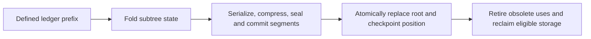

# Clef completion through BAREWire, platforms, parallelism and storage

2026-09-13. Companion to [Clef language completion: design and architecture analysis](Clef_Language_Completion_Analysis.md).

## September 19 implementation waypoints

The current language work uses Composer's roadmap, Baker nanopass
elaboration/saturation and Alex's Huet-zipper pull architecture. Roadmap order is
revisable: completion, semantic prerequisites and demonstrated coverage govern
the next slice. The owner has
identified the following complementary checks. The historical scope and first
work window described later in this document remain dated records.

| Project | Role in language completion | Comparison or gate |
|---|---|---|
| FidelityHello series | Source-to-artifact behavior oracles for the functional foundation | Compile and verify the emitted MLIR, lower it, run the executable and check both exit status and expected output; add lettered variants for distinct use cases, alongside CCS and Alex unit coverage |
| Fidelity.UI | Triangulation for a quiet, compositional display API | Ordinary functions/pipes/lists and optional CE construction must preserve the same semantic operations, cold activation, typed bindings, owned state, identity and retirement across admitted display profiles |
| HelloWayland | Paired imperative/reference and expanded FP realizations | Keep the current form available; compare equivalent input/event streams, model transitions, rendered output, parallel work and resource lifetime against the new form; record known discrepancies explicitly |
| WrenHello | Application and native/WebView boundary exercise | Functional protocol/model composition, callbacks, owned reactive behavior and the actual bundled/embedded artifact |
| HelloProof | Proof-dispatch and artifact-correspondence exercise | Applicable graph obligations, participant/provenance identity, actual solver results and preservation through the realized artifact |
| HelloArty and HelloDISCO | Board deployment and execution checks as syntax expands | Source and artifact checks first; separately record connected-device programming, execution and relevant display/I/O observations |

Fidelity.UI is more than an output oracle: its
[component model](../../Fidelity.UI/docs/02_component_model.md) and
[reconsideration](../../Fidelity.UI/docs/08_ui_model_reconsideration.md) test
whether the language features compose into a usable API. Its semantic/control
tree, reactive dependency graph, spatial/damage structure and execution ownership
remain distinct. A visual area does not imply an actor or thread. Resource
acquisition, reactive binding and async waiting retain their separate meanings
under any CE facade. Display capability/placement obligations travel through the
same program identities; one accepted host does not establish every device's
realization.

The board checks require connected hardware and are not inferred from successful
host compilation. Existing applications remain the reference while richer source
forms are introduced alongside them. These waypoints exercise the existing
roadmap and reveal where its coverage or proposed ordering needs revision.

Each implementation waypoint includes CCS, Alex, CCS.Editor/Lattice, the analyzer
corpus, CAC's query handoff and affected clients/grammar. The
[coverage record](Language_Coverage_Waypoints.md) binds their revisions and gates;
an explicitly reviewed inactive dependency is distinguished from an untested tool.

## Original September 13 framing

This review extends the language analysis with the authorized recent Clef writings, BAREWire documentation, Fidelity.Platform's MCU/MMIO and board documentation, and the MBS storage specification and companions. It is framing for language and compiler work. It does not implement storage, drivers, radio services, client applications or another project's platform. Implementation reports below describe their documented snapshots; no implementation source, build, hardware or external service was inspected or exercised here. Preprints and the negative/fractional-type extension remain excluded.

The conclusion is that functional completion must support whole workloads whose data, arithmetic, resources, effects and recovery rules compose. MBS is a particularly strong exercise because its modest public surface already requires generic records, opaque handles, higher-order predicates, bounded memory, cryptographic computation and durable state transitions. BAREWire supplies the structural contracts through which those workloads meet memory, devices, other processes and remote endpoints.

## 1. Information preservation through final representation

**Final untagged layout follows information-preserving compilation.** Clef's types, dimensions, layouts and obligations remain available through the PSG, MLIR and backend stages for as long as analysis, realization or preservation needs them. The witness carries settled consequences into executable structure and the codata/annotations needed by downstream consumers; it does not discard the semantic account at the AST or PSG exit. Information is set aside only after its role is fulfilled, with affected properties preserved or reestablished at each lowering edge. This requires neither retaining every graph object verbatim forever nor making the witness repeat semantic analysis. [Substrate formalism](../../BAREWire/docs/Substrate_Formalism.md), [backend lowering](../../clef-lang-spec/spec/backend-lowering-architecture.md), [obligation residency](Obligation_Residency_Design.md).

The particular loss to avoid is reification into a BCL carrier that abandons the units-of-measure structure. In Clef, dimensional types must continue to inform **numeric selection, narrowing and memory layout**. Selecting an integer or real carrier settles a representation decision; it does not authorize discarding dimensional facts still needed to justify another operation, adaptation, layout or boundary mapping. A carrier's width alone cannot recover the source's dimensional meaning. [NTU types](../../clef-lang-spec/spec/ntu-types.md), [numeric selection](../../clef-lang-spec/spec/numeric-selection.md), [dimensional handoff](../../clef/docs/fidelity/phg/Dimensional_Handoff.md).

| Compilation/realization stage | Information responsibility |
|---|---|
| CCS/Baker and PSG | Establish source type/dimension identity, relationships, representation and resource decisions, applicable obligations and evidence |
| Witness and portable MLIR | Realize settled structure while carrying the information and correspondence still required by later consumers |
| Target backend and transforms | Use the retained facts for target commitment, numeric adaptations and layout; preserve or recheck properties affected by transformations |
| Final native/BARE layout | Omit self-describing compiler type/schema/dimension/proof tags after their lowering roles are fulfilled; retain required operational structure and checks |
| JavaScript/Cloudflare bridge | Realize the contract through the selected host objects, dictionaries, tags or byte views as needed, with declared boundary conversion and preservation obligations |

For an untagged BARE mapping, a receiver interprets bytes through the agreed structure; it cannot discover their intended types or physical dimensions by inspecting them. JavaScript and Cloudflare Workers bridges can retain host-managed dictionary or tagged representations where that target needs them. Their correspondence with Clef values and BAREWire layouts belongs in the target-engaged contract. The untagged payload rule does not require all host values to become native byte layouts or strip runtime structure required by a host API. [Substrate formalism](../../BAREWire/docs/Substrate_Formalism.md), [JavaScript boundary](../../clef-lang-spec/spec/javascript-boundary.md).

An application union's case index, an optional's presence bit, a ledger's predecessor digest, a record handle, or a protocol's correlation identifier can still be actual data in the agreed structure. They serve their declared operational purpose; they are not self-describing memory tags. Likewise, a runtime bounds or generation check does not turn the representation into tagged memory. Some premises depend on runtime input and must be checked there under the compiler-established contract.

BAREWire's inward and outward roles use this same discipline. Inward, its declarations describe platform memory spaces, buffers, boundaries and transports. Outward, they describe the meaning preserved across views, codecs, IPC and wire boundaries. A shared-memory view need not serialize a value to participate. Packed BARE encoding, natural foreign ABI layout and a JavaScript byte view are different mappings; equality of byte count does not establish compatibility. [Platform description](../../BAREWire/docs/11%20Platform%20Description.md), [hardware descriptors](../../BAREWire/docs/08%20Hardware%20Descriptors.md).

The three observers of a declaration—emission, layout/placement constraints and proof obligations—must refer to the same original declaration and actual realization. Re-solving its unchanged formula after emission cannot establish that emitted code uses the promised allocation, offset, width or lifetime. This is why BAREWire belongs in the PSG/proof architecture rather than being treated as a serializer attached at the end. [Substrate formalism](../../BAREWire/docs/Substrate_Formalism.md), [preservation obligations](../../BAREWire/docs/12%20Intersection%20Subset.md).

## 2. What the intentionally simple bindings tell us

BAREWire explicitly describes its intersection subset as a property of a compiler build, not the language. Its accommodation markers name preferred forms to restore. Fidelity.Platform's driver roadmap similarly directs the next effort toward Clef support for DSP and cryptography, preserving accepted hardware checkpoints while leaving richer driver decomposition and data shapes open to refactoring. [Intersection subset](../../BAREWire/docs/12%20Intersection%20Subset.md), [driver roadmap](../../Fidelity.Platform/docs/STM32H7_DRIVER_ROADMAP.md), [language readiness](../../Fidelity.Platform/Profiles/STM32H747I_DISCO_Synth_Reference/scaffold/LANGUAGE_READINESS.md).

| Present accommodation or bounded checkpoint | Language capability it makes concrete | Contract a later refactor must preserve |
|---|---|---|
| String aliases and scalar constants for closed vocabularies | Closed unions, generic aggregates and reliable pattern elimination | Declared case/byte mapping, source identity and boundary validation |
| Arrays, while loops and linear tables | Immutable collections, folds, maps and higher-order predicates where appropriate | Provisioned capacity, traversal bounds and observable evaluation |
| Single-level matches and fault conventions | Nested patterns, options/results, record updates and compositional failure | Incomplete input, malformed input, absence, cancellation and failure remain distinct |
| Restricted generic use and manually arranged callback state | Generalization, specialization, capturing functions and partial application | Captured identity, representation, validity, effects and final ABI |
| Packed display state and scalar asset selection | Typed models/events, pure transitions and changed projections | Coherent state, bounded effects and actual display publication/completion |
| Literal platform records and immutable aliases | Richer declaration composition when its compile-time reader is defined | Selected source closure and original resource identity, without accidental runtime initialization |

These are acceptance consumers for language completion, not instructions to replace every module function or explicitly threaded cursor. Those forms can remain good functional designs. Higher-level APIs must retain fixed boundary formats, bounded storage and source-selected target bindings; historical object/provider registries do not become the destination. [IPC platform ownership](../../BAREWire/docs/07%20IPC%20Platform%20Specific%20APIs.md), [display model](../../Fidelity.Platform/docs/DISPLAY_MODEL.md).

Platform declaration composition deserves particular care. A copied record with equal fields does not become the original authorized memory region. Current selection follows one export in the selected package's transitive source closure, retaining declaration identity through dependency diamonds. Supporting ordinary higher-order functions does not automatically authorize arbitrary function evaluation by the metadata reader. [Platform composition](../../Fidelity.Platform/docs/PLATFORM_COMPOSITION.md).

## 3. Concrete platform breadth and its implications

The recent expansion supplies distinct execution and artifact obligations. The table records documented acceptance, not new measurements or acceptance of every peripheral on a board.

HelloWayland also supplies an existing execution baseline: the user confirmed on 2026-09-13 that its CPU implementation has basic parallelism and its GPU version obtains tile parallelism from the GPU realization. Ariel's construct is already taking shape through that work. The language roadmap should use these paths as regression consumers from the functional/environment stages onward, then extend the coordination they can express. This is a user-supplied status fact; this review did not inspect HelloWayland implementation or equate the two target mechanisms with a completed general scheduling contract.

| Platform | Documented exercised scope | Boundary of that evidence |
|---|---|---|
| **EK-RA6M5, Cortex-M33, HelloBlinky** | Retained 2,350-byte image; 112 vectors, 27 register bindings, six grants and 81 access sites. LED/button/PWM/SysTick/external-interrupt and reset/SWD observations are recorded. | September 10 extraction retained earlier hardware evidence; it was not a new deployment. Persistent storage and credential security are not implemented by this milestone. |
| **CCC2026Badge, ESP32-S3, Xtensa LX7, HelloESP** | September 12 Clef→CCS→Composer→LLVM/image path and mask-ROM flash boot; display, five RMT LEDs, buttons and 1 kHz interrupt path observed. | Windowed-call ABI, spill/refill vectors and actual SRAM bus restrictions matter. Radio, second-core execution and general DMA support are outside this workload. |
| **STM32H747I-DISCO, Cortex-M7, HelloDISCO** | September 13 interactive 250,190-byte image, immutable 230,400-byte L8 frame, palette/joystick/LED behavior, readback and debugger-disconnected cold start recorded. | The user subsequently identifies possible processor marshaling for display writes as an active experiment with suspected bugs; that mechanism is not established coordination/publication evidence. Audio, touch, SDRAM, general DMA/cache proofs and M4 ownership remain separate. The synth profile is a requirements scaffold, not an executable instrument. |
| **Arty A7-100T** | Documented pin authority and generated HDL/XDC correspondence for 25 ports. | That run did not supply new hardware programming or timing closure; the workload clock heuristic and physical clock remain separately recorded facts. |
| **Meadow F7, NUCLEO-L552ZE-Q, FPB-RA6E2** | Product/reference documentation and future target consumers. | These records do not establish accepted Fidelity bring-up. Meadow's actual board revisions and radio companion need their own reconciliation. |

Sources: [RA6M5 source record](../../Fidelity.Platform/Hardware/Products/Renesas/EK_RA6M5/docs/SOURCE_MANIFEST.md), [HelloBlinky hardware record](../../Fidelity.Platform/Hardware/Products/Renesas/EK_RA6M5/docs/HELLOBLINKY_HARDWARE.md), [ESP32-S3 bring-up](../../Fidelity.Platform/docs/ESP32S3_BRINGUP.md), [H7 synth/design checkpoint](../../Fidelity.Platform/docs/STM32H7_SYNTH_DESIGN.md), [Arty profile](../../Fidelity.Platform/Profiles/ArtyA7_HelloArty/README.md), [platform taxonomy](../../Fidelity.Platform/PLATFORM_STRUCTURE.md), [Meadow product](../../Fidelity.Platform/Hardware/Products/WildernessLabs/MeadowF7/README.md), [NUCLEO product](../../Fidelity.Platform/Hardware/Products/ST/NUCLEO_L552ZE_Q/README.md), [FPB product](../../Fidelity.Platform/Hardware/Products/Renesas/FPB_RA6E2/README.md).

Hosted Linux execution and the RestrictedGuest64 static-MMIO exercise add useful different cases. Strix Halo, Apple/Metal/FPGA and BPF profiles describe reference handoffs or scaffolds; they do not establish a deployed multi-target runtime. A physical allocation counted through several CPU/device views still supplies its capacity once. A NIC transmission completion and an accelerator's completed application result are different events. [Admission and sidecars](../../Fidelity.Platform/docs/ADMISSION_AND_SIDECARS.md).

The ownership chain is already designed: silicon supplies exact part and transaction facts; the product supplies installed components and wiring; the environment supplies ABI/services; the profile selects execution and budgets; the application selects workload access and policy. BAREWire supplies the common structural vocabulary. Hardware availability alone grants no access.

MMIO makes the semantic boundary concrete. Device regions, registers, mappings, grants and the selected access plan identify availability, transaction shape, address establishment and workload permission separately. CCS checks the admitted immutable integer/Boolean predicate fragment and retains site/dependency evidence; required pending facts block lowering. Pointer width, transaction width and source value range remain independent. `<@ true @>` cannot waive mandatory checks. Composer consumes the result. [MMIO contracts](../../Fidelity.Platform/docs/MMIO_CONTRACTS.md).

That established fragment is not a general memory-coherence proof. Volatile access does not synchronize ordinary RAM, program an MPU, establish DMA reachability or supply a device-completion protocol. The platform carrier design explicitly allows authored declarations, derived context, node codata and joint relationships without requiring a new global PSG head node or one monolithic SMT query. [Carrier location](../../Fidelity.Platform/docs/D4b_PLATFORM_CARRIER_LOCATION.md).

## 4. Fearless parallelism has several simultaneous obligations

The September parallelism article distinguishes **safe access, progress, preservation of the result under admitted execution choices, and numerical accuracy**. Functional structure makes dependencies and transformations inspectable; purity alone does not discharge all four. [Pondering Fearless Parallelism](../../clef-lang-site/hugo/content/blog/pondering-fearless-parallelism.md).

TwoSum illustrates why ordinary functions and returned products matter immediately. The residual pair can have a bounded, allocation-free realization under its precise arithmetic premises. It is not an unlimited accumulator. A sequential rounded fold, a fixed input-indexed reduction tree and an exact accumulation contract are different source observations; an optimizer cannot interchange them merely because one parallelizes well. [Arithmetic construction and placement](../../clef-lang-site/hugo/content/docs/internals/numerics/arithmetic-construction-and-placement.md).

An exact reduction requires admitted identity, ingestion, merge and finalization laws, inclusion of the same represented terms exactly once, and capacity for **every reachable intermediate partial**, including large partials before cancellation. Exact sums of rounded products and exact sums of exact represented-input products differ. If a partial crosses BAREWire, its representation must preserve the precision required by that construction. Rounding it to shrink a message changes the contract unless justified. Construction and placement affect memory, communication, synchronization and arithmetic cost; compare only candidates already admitted by the required semantics.

BAREWire's dispatch-region design supplies the corresponding memory discipline:

| Concern | Relationships that must meet at the actual dispatch |
|---|---|
| Spatial access | Canonical backing and address-space identity; half-open slices; complete direct and indirect read footprint; immutable supplied inputs; complete iteration coverage; disjoint output writes; count/byte/address bounds |
| Temporal validity | Initialization before publication; assignment and completion; acquire before consumption; all participant retirement before reuse; failure and partial-admission cleanup; generation identity |
| Substrate realization | Actual mappings and aliases, device-master reachability, coherence domain, required ordering operations, cache alignment/stride/padding and external premises |
| Callable representation | The actual worker entry and capture layout, including fields, types and access—not merely an equal total environment size |

Disjoint writes can still false-share a cache line. A zero remaining-work count need not mean the final participant's bookkeeping has retired. A pure spatial validator supplies neither lifecycle permission nor an allocator implementation. These distinctions are explicit in [Dispatch Regions](../../BAREWire/docs/13%20Dispatch%20Regions.md) and qualify broader historical cache/concurrency claims.

## 5. MBS makes the functional and resource requirements unavoidable

The MBS chapter carries normative-style requirements while expressly identifying itself as a captured, not-yet-ratified draft. It belongs to the Freestanding Substrate profile. Its structure is definite enough to frame language acceptance without claiming that a complete storage target already exists. [MBS specification](../../clef-lang-spec/spec/modular-blob-storage.md).

An instance stores one record shape, `MBS<'Record>`, in provisioned slots. Records may contain several components but are written and read whole. A completed write issues an opaque, stable `Handle<'Record>`; labels are optional, nonunique selection attributes, not addresses. The fixed index contains only non-secret attributes, and `find` applies a caller predicate in a scan bounded by slot count. The store has no heap fallback. Exhaustion is a reported error under the specified contract.

This requires more than replacing imperative loops with combinators:

1. **Data abstraction must survive composition.** Generic records, optional fields, nested patterns, opaque handles and specialization must preserve record identity and agreed representation. A predicate's captured values and permitted behavior remain visible through higher-order application. The compiler cannot erase those facts at the generic call.
2. **Allocation must account for the complete operation.** Static store/index capacity, an unsealed record's secure working region, codec/cryptographic scratch, intermediate aggregates and closures all need valid placement. A richer source record does not imply a heap allocation. A final record fitting its slot does not prove the peak working set fits.
3. **Failures remain semantic outcomes.** Full provision, invalid or unavailable data, interrupted operations and target capability refusal cannot be collapsed into an ordinary empty record or manufactured success. The analysis does not invent a new API spelling for those outcomes.
4. **Secret lifetime constrains higher-order execution.** Capturing a plaintext record in a function, sequence or suspended computation extends its uses. The owning secure region must remain valid for those uses, and the required release/destruction behavior must survive cancellation and failure. Persisting a record does not automatically make an arbitrary closure or continuation safely durable.
5. **Crypto must remain analyzable through abstraction.** The specified direction includes verifiable functional code with constant-time, secret-independence and allocation obligations, or an explicitly selected hardware boundary. Functional purity by itself proves none of those security properties. Target operations and optimization must preserve the actual admitted properties.

MBS specifies device-bound key custody and a 256-bit-class symmetric seal, while leaving the software/hardware realization a decision recorded for each target with its verifiability cost. That contract does not select a cipher mode, nonce protocol or new cryptographic scheme in this analysis. The Credential Authority chapter adds structured keys, credentials, derivation and delegation, but explicitly defers important definitions and proof details. It contributes language requirements without supplying a completed crypto implementation. [MBS §§5–7](../../clef-lang-spec/spec/modular-blob-storage.md), [Credential Authority outline](../../clef-lang-spec/spec/credential-authority.md), [Platform language readiness](../../Fidelity.Platform/Profiles/STM32H747I_DISCO_Synth_Reference/scaffold/LANGUAGE_READINESS.md).

The memory chapter fixes the lifetime/coeffect mechanism and placement floor while identifying remaining lifetime-ordering specification work. Arena operations and an arena reset are not a completed proof that every retained value's use is valid. There is no ownership/borrowing annotation vocabulary to invent in the source as a workaround; the intended discipline is graph-carried coeffects and obligations. [Memory regions](../../clef-lang-spec/spec/memory-regions.md), [arena design](../../BAREWire/docs/Arena_Design.md).

## 6. Durable publication and concurrency must compose

The storage blog's strongest design contribution is the continuity from a small sealed store to a namespace whose cold metadata uses the same substrate. NSS represents namespace history as hash-linked `(old, new)` change entries and derives state by an ordered fold. It checkpoints subtree state into serialized, compressed, sealed MBS segments. A root record names the segment set and checkpoint position. The hot set, slots and replay tail remain bounded by provision and compaction policy. [An Emergent File System Model](../../clef-lang-site/hugo/content/blog/an-emergent-file-system-model.md), [NSS specification](../../clef-lang-spec/spec/namespace-storage.md).

The specified checkpoint dependency is:

The root must never reference uncommitted segments. Reclamation also has to respect active uses; the diagram combines the NSS publication order with the existing memory-lifetime discipline, not a newly selected locking or storage algorithm.

“Storage on Metal” supplies the precise realization qualifications: whole-record calls do not make flash programming atomic; a target primitive or commit protocol must recover an old or new valid record after power loss. Erase/program granularity, torn writes and recovery belong in that realization. Confidentiality alone does not establish integrity, freshness or rollback protection; a hash chain detects tampering relative to a trusted anchor, not every replacement by an older valid chain. Finite flash still requires reclamation, endurance and power-failure behavior. These are already documented obligations. [Storage on Metal](../../clef-lang-site/hugo/content/docs/internals/hardware/storage-on-metal.md).

For the language roadmap, fearless storage concurrency therefore means demonstrating the following relationships under the selected library/target contract:

- Independent work may overlap only where its input snapshot, effects, scratch capacity and resource use permit it. A functional interface does not make all store operations commute.
- Ledger appends, chain formation and root publication retain their required order. An ordered namespace fold cannot silently become an unordered parallel reduction. Any alternative decomposition needs a law preserving that fold's meaning.
- Checkpoint preparation refers to a defined prefix and segment set. Concurrent activity cannot cause publication of a root assembled from incompatible states. Readers and suspended work keep valid access for their admitted lifetime.
- Slot reuse follows both durable recovery requirements and retirement of live uses. Capacity includes simultaneous old/new state, in-flight work and required recovery material; steady-state size alone is insufficient.
- Interrupted admission, cancellation and failure preserve the declared recoverable state. Physical completion, durable commitment, handle publication and delivery of the result to a caller are distinct events.

These are derived completion criteria, not a choice of mutexes, a lock-free algorithm, a journal format, a cryptographic construction or a new storage API. The source contracts specify the behavior to retain; the affected implementation slice must supply its admitted realization and evidence.

The same distinction applies to durable distributed joins in the September JavaScript writing. An accumulator must denote exactly the accepted logical contributions; accepted identities and arithmetic state must commit or reconstruct consistently. Duplicates, stale versions and execution retries are protocol facts that arithmetic associativity does not solve. A local durable write does not make an external effect exactly once. [Carrying Proofs into JavaScript](../../clef-lang-site/hugo/content/blog/carrying-proofs-into-javascript.md), [actor/workflow proof contract](../../clef-lang-site/hugo/content/docs/design/javascript-targeting/proof-preservation-across-actors-and-workflows.md).

MBS/NSS provide freestanding storage contracts. A hosted JavaScript realization can use declared host persistence; it does not thereby claim a freestanding flash backend. Sharing BAREWire bytes also does not migrate a native pointer or host continuation. Resumption needs the right live state, logical identity, code/version compatibility, retained external observations and valid target-local resources.

## 7. Radio, IPC and the supplied remote deployment frame

The same structural requirements extend through communication. BAREWire owns the agreed payload/layout contract; Fidelity.Platform owns actual OS/device operations. Encoding, envelope framing, medium wrapping and session state have different jobs. Hello carries epoch/build fields, but encoding those fields does not implement session agreement or rejection. A length prefix does not establish receive capacity. [IPC platform seam](../../BAREWire/docs/07%20IPC%20Platform%20Specific%20APIs.md), [readiness audit](../../BAREWire/docs/Readiness%20Audit.md), [substrate formalism](../../BAREWire/docs/Substrate_Formalism.md).

The radio design calls for bounded typed commands/events, connection-generation identities, subscription lifetime, callback-buffer ownership, queue limits and distinct timeout/cancellation/failure outcomes. Local enqueue, protocol acknowledgement and application acknowledgement remain different events. Saved preferences do not restore a live connection. Bond keys, Wi-Fi credentials and durable protocol state connect directly to entropy, key custody and the storage discipline above. [Radio model](../../Fidelity.Platform/docs/RADIO_MODEL.md).

The badge's ESP32-S3 has Wi-Fi/BLE hardware; its accepted workload does not exercise radio. DISCO has no onboard radio, and a connector is not an installed module. Meadow's STM32F7 plus ESP32 companion is another composition with its own firmware and interprocessor contract. The current radio documents are scaffolds, not accepted radio drivers. Standard Bluetooth/Wi-Fi protocol formats remain standard formats; BAREWire does not replace them with a private envelope. [Radio hardware](../../Fidelity.Platform/Hardware/Silicon/Radio/README.md), [radio protocols](../../Fidelity.Platform/Protocols/Radio/README.md).

QUIC/MoQ are documented communication directions in the actor writings, with transport and streaming realization still distinct from the built codec/envelope tiers. The user's Cloudflare One/WARP and zero-trust context belongs to deployment connectivity and access policy. The authorized local corpus does not elaborate a concrete One/WARP adapter or policy; this analysis carries the intended context without inventing one. A permitted communication edge, an authenticated peer, an agreed schema and a correct application transition require related but distinct evidence. [Actor transport direction](../../clef-lang-site/hugo/content/blog/unified-actor-architecture.md), [streaming contract](../../clef-lang-site/hugo/content/docs/design/javascript-targeting/streaming-inference-through-the-actor-pipeline.md), [BAREWire status](../../BAREWire/docs/Implementation%20Status.md).

For a stream, storage remains valid until the transport has finished using it under its ownership/completion contract; a copying adapter can finish using the original storage before the whole send completes. Logical streams share physical budgets, and reconnection obeys an explicit replay/abandonment contract. For a shared region, publication/acquire and retirement govern visibility and reuse. For a radio callback, borrowed bytes remain within their lease or move into admitted owned storage. These are related language/resource exercises even though their substrates differ.

## 8. Consequences for PSG, continuations and interaction nets

The deeper compiler requirement is joint reasoning over the **same participants**. For MBS, that includes the record shape, slot class, secure working allocation, key-custody premise, codec/seal operation, durable commit and returned handle. For checkpointing it additionally includes the selected ledger prefix, segments, root and storage eligible for retirement. For parallel work it includes the actual capture, partition, buffers, result identity and admitted arithmetic construction.

MBS names the durability components `survives-power-loss`, `atomic-write` and `sealed`; NSS adds `chained` and `replayable`. These meet region, lifetime, numeric and representation facts on the PSG and commit against the selected target's capabilities. They describe obligations and consequences carried through compilation, not tags attached to persisted records. The authority remains CCS semantic settlement followed by carried evidence and target realization, including where older storage prose calls that analysis simply “middle end.” [MBS](../../clef-lang-spec/spec/modular-blob-storage.md), [NSS](../../clef-lang-spec/spec/namespace-storage.md).

Each supported analysis can use its own procedure while retaining its connection to the common obligation. Structural inference, integer constraints, temporal/resource rules and imported crypto or numerical laws do not become one undifferentiated solver verdict. Composer's proof service must instantiate admitted laws, check the needed correspondences and premises, and retain result status and invalidation dependencies. Required unresolved facts stay unresolved. No manual application annotation should be needed merely to activate already-supported obligations. [Proof composition architecture](Proof_Composition_Architecture.md), [proof composition and tooling](../../clef-lang-site/hugo/content/docs/internals/verification/proof-composition-and-tooling.md).

Delimited continuations make resource validity observable across time. Suspension may retain an unsealed record, decoder buffer, pending write, radio generation or view of a checkpoint. The graph must carry the live values and obligations through suspension, delivery, cancellation and retirement. Reusing or duplicating a continuation cannot silently duplicate a one-time publication, release a region twice or revive a retired handle. An immutable reference does not freeze its mutable referent. The established continuation contract must govern these cases, without inventing a new source ownership vocabulary. [Continuation specification](../../clef-lang-spec/spec/dcont-representation.md), [actor/workflow preservation](../../clef-lang-site/hugo/content/docs/design/javascript-targeting/proof-preservation-across-actors-and-workflows.md).

Interaction-net resolution must preserve the source's resource and effect behavior. Pure preparation regions may expose parallel choices where an admitted rule permits them. MMIO, entropy acquisition, durable commitment, acknowledgements and reclamation do not become freely duplicable or reorderable because they are represented in a graph. Static graph readiness is distinct from runtime progress, rule confluence and termination. This frame strengthens the existing net acceptance obligations; it proposes no alternative calculus or semantic dialect.

CCS/Baker establish and settle those semantics in the PSG. Composer orchestrates their checking and realization. MiddleEnd/Alex witness the settled structure and report missing required facts; they do not rediscover storage, crypto, closure, scheduling or net semantics during emission. The thin middle end remains an information-preserving MLIR stage: settled type/dimensional consequences and the metadata/correspondence needed downstream survive witnessing. Backend transformations preserve or reestablish affected properties against actual operations and artifacts, setting information aside only when its remaining role is fulfilled. [Thin middle end](Thin_Middle_End_Design.md), [single flattening](Single_Flattening_Design.md), [obligation residency](Obligation_Residency_Design.md).

## 9. How this sharpens the existing completion sequence

The sequence in the main analysis remains sound. These workloads turn each stage's gate into something concrete while allowing the present bindings to remain useful until their replacements pass.

The user has selected **HelloDISCO LED/screen settings persistence as the first consumer** for a proposed two-to-three-hour implementation window. Encryption is deferred, and replacing the settings is acceptable. The first application result is therefore a small typed settings record saved and restored across a power cycle, using an MBS-like whole-record structure. Full MBS conformance, credential custody and namespace storage are not claims of this initial experiment.

The functional slice should preserve the logical selected state separately from a partially completed display transaction. The immutable frame asset need not become the persisted payload; restored screen settings feed the existing initialization/publication path. The record layout, permitted values, coherent snapshot, bounded codec and failure outcomes become concrete compiler acceptance cases. Blank, invalid and interrupted-write behavior must be stated before the hardware write step. The user has not selected a new persistence format or a save-trigger policy in this discussion. [Display model](../../Fidelity.Platform/docs/DISPLAY_MODEL.md), [palette initialization and publication](../../Fidelity.Platform/Hardware/Silicon/MCU/ST/STM32H7/STM32H747XIH6/docs/display/CLUT_SUPPLEMENT.md).

The window's feasibility depends on establishing the new hardware write capability: a reserved region with original declaration identity, correct image/boot separation, exact erase/program rules, bounded completion/failure behavior and any execution/display interference. Current documentation accepts ROM asset reads and records debugger programming; it does not establish application persistence. Neither internal bank nor an external memory is selected merely because its address or capacity is known. This is the first implementation gate, followed by the required functional/PSG/witness changes and a real save–power-cycle–restore acceptance. [Storage roadmap](../../Fidelity.Platform/docs/STM32H7_DRIVER_ROADMAP.md), [bank and boot ownership](../../Fidelity.Platform/docs/STM32H7_SYNTH_DESIGN.md).

| Existing stage | Workload acceptance contributed by this frame |
|---|---|
| Functional expression and inference | Generic record/handle use, captured index predicates, nested option patterns, model transitions, codec composition and ordinary residual-returning arithmetic |
| Shared environments and lifetime | Stored/returned predicates, bounded scratch and aggregate placement, secure captures, callback retention, reset/retirement rejection and actual target ABI/layout; preserve existing HelloWayland parallel behavior as these forms expand |
| Collections and deferred computation | Bounded index scans, ordered ledger folds, hot-set lookup, deferred reads and partial decoding with correct effects and exhaustion |
| Suspension and coordination | Extend the existing CPU/GPU execution baseline with richer work and suspension; delayed completion while storage remains valid; cancellation/failure; stale callbacks; safe publication and retirement; consistent durable join state |
| Net and parallel realization | Admitted pure decomposition, complete access footprints, intermediate arithmetic bounds, effect-preserving reduction and actual substrate progress premises |
| Profile/proof expansion | One complete declared-to-emitted proof bridge, then additional storage, numerical, communication and target contracts with scoped positive and rejecting cases |

Each slice needs source behavior, graph facts and obligations, realized operations with correspondence, and actual acceptance results for that revision. Useful rejecting cases include a wrong record/contract, insufficient peak capacity, escaping secure storage, mismatched backing identity, stale result generation, duplicate contribution, root referencing an uncommitted segment, premature reuse and an unavailable target capability. These are proposed future gates; none was executed in this review.

Existing physical checkpoints should remain regression evidence at the behavior/ABI/access seam. Richer source APIs need not preserve incidental packed integers, scalar lookups or assembly adapters. Conversely, a successful source refactor must not silently change the bytes, memory budget, access grant, cryptographic premises, visible update order or recovery semantics. [Scaffold handoff](../../Fidelity.Platform/Profiles/STM32H747I_DISCO_Synth_Reference/scaffold/README.md), [language readiness](../../Fidelity.Platform/Profiles/STM32H747I_DISCO_Synth_Reference/scaffold/LANGUAGE_READINESS.md).

For HelloDISCO, the user's subsequent report of suspected display-write marshaling bugs qualifies the experimental mechanism separately from those historical observations. Its intended ordering, ownership and completion behavior can supply investigation cases; the current implementation is not yet an oracle for those contracts. The report does not identify the exact mechanism or defects, and this review makes no assumption about multicore dispatch, DMA or the cause of the bugs.

## 10. Reading scope and evidence standing

The review included the seven August/September site entries from “Fixing on Falcon” through “Carrying Proofs into JavaScript,” the earlier “Fearless Concurrency Gets Real,” their arithmetic/proof companions, the storage and directly relevant lifecycle writings, and the BAREWire/actor/reactivity/streaming accounts. The recent essays frame the remit; normative chapters and current adopted compiler designs govern semantics. Research extensions mentioned inside an authorized article were not adopted or followed into preprints.

BAREWire coverage included its root/index, Substrate Formalism, chapters 00–13, Arena Design, Implementation Status, Readiness Audit and the historical dependency-removal document. Fidelity.Platform coverage included its architecture/taxonomy/composition/MMIO/carrier/admission documents, display/radio/synth/driver handoff, and the named CPU, silicon, environment, board and profile documents. MBS, NSS, Credential Authority, Memory Regions and Storage on Metal were read as storage contracts and qualifications, not reconstructed from implementation code.

Historical examples were reconciled using explicit supersession and later bounded evidence. Old per-frame schema-tag and runtime-provider sketches do not govern the adopted BAREWire contract. Earlier M33-only or non-executable-Xtensa prose does not negate the later named hardware checkpoints. Conversely, earlier successful native codec gates do not erase the later reported native failures, and JavaScript checks of declaration-derived formulas do not certify emitted JavaScript. A reference checker, source report, physical observation and checked proof each retain their actual scope. [Intersection subset](../../BAREWire/docs/12%20Intersection%20Subset.md), [MMIO evidence](../../Fidelity.Platform/docs/MMIO_CONTRACTS.md), [admission scope](../../Fidelity.Platform/docs/ADMISSION_AND_SIDECARS.md).

This framing selects no undocumented target commit protocol, crypto construction, radio backend or application deployment policy. Those details become requirements of their eventual implementation slices. It establishes why the language must express, analyze and preserve the full functional structure through compilation and each selected target representation.
