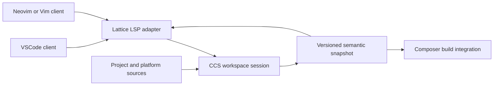

# Lattice integration with CCS and Composer

Status: first local integration, September 2026. `Composer.slnx` now includes the [CCS editor read service](../src/CCS.Editor/README.md) and [Lattice stdio server](../src/Lattice.Server/README.md). The VSCode development client connects them to dimensional hover, diagnostics, definition lookup and expandable source-proof results. The broader gates below still cover compiler-branch reconciliation and the remaining editor surfaces.

Language requirements remain in the [Clef specification](https://github.com/FidelityFramework/clef-lang-spec). The existing [Lattice consumer contract](https://github.com/FidelityFramework/clef/blob/main/docs/fidelity/phg/Lattice_Consumer_Contract.md) establishes compiler ownership of graph facts. This document connects that contract to the current source and the first deliverables; it does not define another type system or proof ledger.

## Repository map

### Target-aware planning synchronization — 2026-09-20

[M-01 §5](PRDs/M-01-DialectAdmission.md#5-numeric-selection-parallelism-and-design-time-projection)
connects this integration plan to the standard's numeric-selection, arithmetic
construction, RPC wait and scheduler contracts. The required projection extends
beyond CPU layout: retain the selected profile, representation/range premises,
operation eligibility, blocking participants and target assumption manifest.
Keep representation error, computation error, reproducibility and cost separate,
and distinguish established, refuted and unresolved obligations. CCS owns those
facts; the server and clients display the checked version and its source links.

Planned gates pair compiler and editor diagnostics for unsupported arithmetic
modes, invalid decomposition, missing progress/recovery capabilities and stale
target facts, including unsaved repair. Changes to platform declarations must
invalidate affected results. Use the same graph projection for VSCode, Neovim,
CAC's reference cases and the analyzer regression corpus. No new protocol is
invented here; add query fields only with the owning CCS contract and consumer
tests. The [waypoints](Language_Coverage_Waypoints.md) pin this coordinated
planning set separately from existing implementation evidence.

### Current repository responsibilities

The [multi-core CPU plan](./multi-core-cpu.md) uses HelloWayland to exercise
compiler-derived dispatch-region evidence as Ariel develops. Its proposed bounds,
ownership and retirement results belong to the same compiler-owned projection;
the editor does not supply scheduler or memory-safety conclusions.

| Repository | Owns | First integration work |
| --- | --- | --- |
| [clef / CCS](https://github.com/FidelityFramework/clef) | Parsing, project context, dimensional inference, PSG construction, diagnostics and proof obligations | An editor session over existing project checking, structured parse diagnostics and position queries |
| [Composer](../README.md) | Lowering and target artifacts; initial .NET host for the Lattice server and CCS editor read service | Maintain the local sample/server gate against the current CCS reference; reconcile the compiler revisions |
| [lattice-vscode](https://github.com/FidelityFramework/lattice-vscode) | VSCode registration, language-client lifecycle and Clef views | Register Clef and the new server; connect diagnostics and hover; reconcile manifest, command and settings names |
| [lattice-vim](https://github.com/FidelityFramework/lattice-vim) | Neovim and Vim client registration | Connect the same server and project fixture; validate the two client paths separately |
| [lattice-vscode-helpers](https://github.com/FidelityFramework/lattice-vscode-helpers) | Fable bindings for VSCode and language-client APIs | Align the extension's dependency declaration, lock file and referenced helper files |
| [clef-grammar](https://github.com/FidelityFramework/clef-grammar) | Lexical highlighting before compiler results arrive | Add representative Clef token fixtures; keep semantic classification in CCS |
| [ClefAutoComplete](https://github.com/FidelityFramework/ClefAutoComplete) | Earlier FSAC bridge and protocol implementation reference | Extract useful protocol-test patterns; the missing old compiler reference is not the new server entry point |
| [lattice-analyzers](https://github.com/FidelityFramework/lattice-analyzers) | Inventory and acceptance cases for analysis features and proposed slots | Classify required compiler checks, graph projections and optional questions; retire the inherited FCS SDK integration |

The initial host is .NET, matching Composer's current `net10.0` project. This does not select .NET semantics for Clef source. F# and Fable remain usable implementation tools for the server and extension. The VSCode development client now uses `clef` and `lattice.*` for its language, settings and commands. The published extension ID and server tool command must be settled with their actual packages, then tested against the documentation; no installable Lattice server command is assumed here.

### Local demonstration and client checks

The [VSCode development client](https://github.com/FidelityFramework/lattice-vscode/tree/fidelity/client) supplies an F5 **Lattice: HelloDimensionsProof** launch. It builds the server, prepares the grammar and opens an editable copy of the [two-file sample](../samples/lattice/HelloDimensionsProof/README.md). Its semantic host test uses actual CCS and cvc5. Separate protocol-fixture tests check transport and lifecycle without claiming compiler semantics. The small JavaScript client does not load the inherited F#/Fable feature implementation.

The [Neovim shim](https://github.com/FidelityFramework/lattice-vim) registers Clef against a configured stdio server; its real-editor test currently uses a protocol fixture. The [grammar gate](https://github.com/FidelityFramework/clef-grammar) tests TextMate tokenization, including measured literals and incomplete editing input. Plain Vim and Neovim's compiler-backed semantic gate remain separate work.

## Current compiler boundary

Composer's [project reference](../src/Composer.fsproj) selects `../../clef/src/Compiler/Clef.Compiler.Service.fsproj`. Its [project loader](../src/FrontEnd/ProjectLoader.fs) calls CCS; the [integration module](../src/FrontEnd/CCS/Integration.fs) exposes the resulting graph and diagnostics.

The `main` checkout selected by that reference and the dimensional rescue on `fidelity` have diverged. The latter also has worktree changes. This local demonstration uses Composer's existing `main` CCS reference and records the actual compiler assembly hash in each snapshot. It does not merge or replace the fidelity work. Consolidating those changes into one reviewed compiler revision remains gate 0; success with this sample does not establish that reconciliation. Both checkouts already have volatile-source checking.

| Existing surface | What it supplies | What is still needed for editors |
| --- | --- | --- |
| [ProjectChecker](https://github.com/FidelityFramework/clef/blob/main/src/Compiler/Project/ProjectChecker.fs) | `checkProjectWithVolatile`: `.fidproj` plus absolute-path/source overrides; source ordering and shared checking; `getDiagnosticsForFile` | Session ownership, dependency invalidation and versions around these calls |
| [NativeService](https://github.com/FidelityFramework/clef/blob/main/src/Compiler/NativeTypedTree/NativeService.fs) | Parsing and checking; successful and failed results; node/binding access | Located, structured parse diagnostics instead of strings; an explicit editing intent for incomplete inputs |
| [Semantic graph types](https://github.com/FidelityFramework/clef/blob/main/src/Compiler/PSGSaturation/SemanticGraph/Types.fs) | Ranges, types, references, selected range/layout facts and obligation nodes | Compiler-owned position/scope indexes and stable read projections |
| [Diagnostics](https://github.com/FidelityFramework/clef/blob/main/src/Compiler/PSGSaturation/SemanticGraph/Diagnostics.fs) | Code, message, severity, range, related nodes and reachability | Preserve these fields in LSP; publish them against the matching source version |
| [Native type rendering](https://github.com/FidelityFramework/clef/blob/main/src/Compiler/NativeTypedTree/NativeTypes.fs) | `formatType` and normalized dimensional presentation | A hover projection selecting the correct source node and instantiated type |
| [ObligationDischarge](https://github.com/FidelityFramework/clef/blob/main/src/Compiler/Nanopass/ObligationDischarge.fs) | Graph obligation projection and optional JSON/SMT artifacts | Compiler-owned dispatch results and live notifications; `emit` itself does not execute cvc5 |

The service should retain useful information for incomplete source. It must distinguish a syntax error, unresolved inference, inconsistent dimensions and missing platform facts. Under [Width Inference §6](https://clef-lang.com/spec/draft/width-inference/#6-unobservable-ranges), pending evidence can remain pending while editing; a required unresolved fact or known coverage failure is diagnosed at commitment. The adapter must not suppress compiler errors or invent a default range, width or layout to obtain a hover.

The current `CCS.Editor` projection supplies serialized sessions, immutable resolved displays, compiler interval/reference lookup, exact input-file inventories and source dispatch results. Structured parser locations remain missing: parser messages go to Lattice output, and semantic/proof requests report the failed check. This limitation is part of gate 1, not a reason to fabricate squiggle locations.

## Server and session design

The first implementation is a small F# LSP server project in this solution using CCS directly. The old FSAC body is reference material; its separate FCS checking path and scope-blind native bridge are not the semantic service to extend.



The diagram is the intended integration. The CLI currently performs its own check; sharing a session with a build request is additional work, not an existing daemon capability.

1. **Inputs and lifetime.** The session owns project inputs and unsaved documents. CCS loads `.fidproj` context, including ordered dependencies and platform declarations. The client owns editing buffers and sends changes; it does not maintain a competing typed-tree cache or parse manifests for semantic decisions. Initially, advertise full-document synchronization and serialize checks rather than claim incremental saturation.
2. **Versioned reads.** Associate results with the project input revision, document versions and compiler revision. Platform and library changes count as input changes. A proof result also identifies its obligation, encoding and dispatch context. An obligation anchor alone is not a freshness key. Freeze the resolved read view before publishing it; later checking must not mutate a view already being read.
3. **Cancellation and stale work.** Superseded results must not replace current ones. If the current checker cannot interrupt a check safely, finish it and discard the outdated result. Cancellation is not a verification failure. Add dependency-aware reuse only after checking isolation and invalidation have tests.
4. **Position and scope.** CCS answers which source node covers a position and which bindings are visible there. Definition queries follow resolved references. An editor scan matching equal names cannot handle shadowing. Convert source ranges to negotiated LSP positions in the adapter, with explicit tests for line numbering, non-ASCII text and line endings.
5. **Projection and transport.** Standard LSP carries diagnostics, hover and later navigation, completion and semantic tokens. Keep graph-version association in the session/request lifecycle and versioned notifications; do not add invented fields to standard LSP responses. Any `clef/*` extension needs a documented, capability-negotiated contract derived from compiler-owned facts.

Start with `.clef` files in one `.fidproj` workspace. Untitled files, `.clefx`, dependency acquisition and multiple projects need their own acceptance checks. Detect unsupported context clearly rather than silently checking a Clef document with the ordinary F# service.

## BAREWire and proof views

[BAREWire](https://github.com/FidelityFramework/BAREWire) is the shared contract and representation layer for memory layout, IPC and network communication. [Fidelity.Platform](https://github.com/FidelityFramework/Fidelity.Platform) supplies target declarations. These are inputs to compiler reasoning: a layout or buffer declaration may participate in an obligation alongside the operation and its established range facts. Dimensions remain part of source type identity; selected representations and layouts are separately justified facts.

The first proof view exposes the obligations CCS already constructs through the negotiated [clefProofs v1 contract](../src/Lattice.Server/README.md#proof-view-contract-version-1). A successful verdict requires actual cvc5 dispatch evidence for the current snapshot. The view retains the claimed property, graph premises, reasoning fragment, source, exact query and query hash. Missing evidence, an inconclusive search and a counterexample have different meanings. Changing a premise invalidates dependent results; changing visibility does not disable checking.

CCS also generates dimensional obligations for reachable measured multiplication, division, addition, subtraction, modulus and numeric comparisons. The Baker recipe links each obligation to the operation and its operands, retaining their inferred dimensions and the actual result dimension. cvc5 checks the operation's exponent equations in `QF_LIA`: multiplication adds exponents, division subtracts them, and compatible arithmetic or comparison requires matching dimensions. Module-qualified measures and formal measure variables retain their identities. This checks dimensional consistency; nonzero divisors, value ranges and numerical precision require their own obligations. The same structured obligation is available to Composer's SMT transfer, while preservation by the emitted program still requires the lowering evidence described below.

Ordinary reachable function calls carry a `dimension-application` obligation at the application site. Its PSG hyperedge connects the call, the instantiated callee occurrence, its actual arguments and, when resolved, the source definition. The check compares dimensions at corresponding argument and result positions, including measured components inside structured values and function types. cvc5 checks the basis and formal-variable coefficients in `QF_LIA`; Composer transfers the same claim and anchor to its SMT dialect. A partial application checks its remaining function signature. This exposes the dimensional compatibility already required by inference without repeating the callee's arithmetic proof. It does not yet propagate real result ranges through the call or establish denominator nonzero conditions.

Real literals retain their exact decimal source value as a rational alongside the hosted approximation: `0.1` contributes `1/10`, including when host rounding changes the stored approximation. A second obligation stage, after platform and layout settlement, checks the literal's singleton range and cross-applies the declaration of its current concrete representation to check finite-bound coverage in `QF_LRA`. An uncovered point is a hard `CCS8012` error. Composer transfers these ground rational comparisons through its SMT dialect by clearing positive denominators, preserving the claim in `QF_LIA`. This slice checks the current literal representation; general real-expression range propagation, optimal representation selection and rounding fidelity remain separate work. Physical layout obligations require a settled storage site.

Integer literals use the same obligation stage to expose their existing analysed range and its coverage by the selected platform representation in `QF_LIA`. The range and representation come from CCS; the proof recipe preserves their provenance rather than selecting a width itself. The combined string-storage layout obligation is shown at the program's unique entry point, with links to the contributing storage sites and any governing space declaration. Its verdict covers the stated layout property.

BAREWire is the memory-layout mechanism. Fidelity.Platform's BAREWire declarations enter the PSG and govern placement. For reachable static string literals, CCS now retains the declared space's base, growth and granularity as well as capacity, alignment and access. After placement settlement, `StaticStringLayout.settle` invokes BAREWire's `StaticStorage.plan` and carries its concrete offsets, UTF-8 bytes, NUL sentinels and padded allocation as one immutable `StaticStringPool` on the graph. This first placement discipline accepts fixed, read-only rodata with a linker-assigned base; unsupported declarations or insufficient capacity are errors.

The `layout_user_strings` obligation is derived from that actual pool. Its `QF_LIA` query checks the concrete extents, non-overlap, alignment, used extent, allocation granularity and declared capacity, without assuming consecutive symbolic bases. Composer consumes the same bytes and offsets to emit one aligned pool with byte views for the literals. A correspondence check on the final structured MLIR rejects mismatched pool contents, alignment or literal views before serialization. This connects the source layout obligation to the storage contract passed to the backend. The compiler and backend toolchain remain part of the trust boundary; an SMT verdict alone is not an independently checked executable certificate.

This entry-point obligation covers the static string pool. It does not claim that every allocation and access in `main` is memory-safe: stack and heap objects, dynamic buffers, lifetimes and lower-generated storage need their own connected evidence. Likewise, the pool's capacity check does not bound every object the linker may put in the containing `.rodata` section. Linker-selected absolute addresses remain separate when the declaration has no base. The broader aggregate-descriptor projection still needs offsets/counts/size/alignment carried into its applicable lowering. Lattice exposes these compiler-owned claims and their scope; it does not infer additional layout guarantees.

The [direct LLVM/LLD backend](./LLVM_Backend.md) preserves this pool contract through bitcode code generation and final ELF placement. The regression gates exercise this connection at separate boundaries: compiler `StaticStringLayoutCases.fs` checks declaration provenance and concrete placement, [SMTTransferRegression.fsx](../tests/SMTTransferRegression.fsx) checks source/native solver agreement including false layouts, and [StaticStorageRegression.fsx](../tests/StaticStorageRegression.fsx) rejects corrupted emitted bytes, offsets, alignment, symbols and proof anchors. [StaticStorageNativeRegression.py](../tests/StaticStorageNativeRegression.py) checks the retained native sample's exact pool bytes, alignment and read-only placement through LLVM and ELF emission, dispatches both query artifacts, and runs the executable. Lattice's real extension-host test inspects the actual entry-point query and its dispatch result. No editor fixture supplies layout facts to the compiler.

Automatically generated obligations need no duplicate source annotation. A suggested lemma application may add the missing relationship, but accepting the edit still leaves the compiler to establish its premises. F*'s [incremental verification tooling](https://github.com/FStarLang/fstar-vscode-assistant) and Dafny's [goal inspection and verification guidance](https://dafny.org/v4.9.1/VerificationOptimization/VerificationOptimization) are useful references. Neither determines Clef's authoring contract or makes an unproved premise true. Dafny's full language admits quantified specifications; the shared practical interest is effective automation within supported fragments.

Design-time proof status and preservation through lowering are separate, linked observations. Follow [Conformance §6](https://clef-lang.com/spec/draft/conformance/#6-the-preservation-obligation-through-lowering): use an established preservation argument or re-check the affected obligation. Keep the external ledger as the scaffold that checks this correspondence while the graph mechanism matures. Do not infer a verdict from the presence of an SMT file.

Standard LSP remains the editor transport. A BAREWire projection for an Atelier/WebView bridge is a later consumer of the same compiler-owned schema; it must not introduce a second graph model. Final payloads need no runtime type metadata after the relevant checking and lowering obligations have been met.

The local VSCode proof sidebar groups evidence by visible Clef file, source line, and obligation. Source drawers follow line order and show the code, obligation count and status summary. Clicking a source link selects the corresponding drawer so its obligations remain together; individual obligations expand into details. Related source sites from other files and obligations without a source location have separate groups. The hierarchy remains populated when source links are hidden. The beaker toggles only those links through `lattice.proofs.showAnnotations`. Separate Expand All and Collapse All controls operate on the hierarchy, including premises, references and solver queries. Neither control changes annotation visibility or redispatches proofs. The section's own caret folds the panel without removing its entry. Checking and invalidation continue throughout. These are presentation choices over the same compiler evidence.

Unused source functions and named immutable local values in executable projects receive compiler warning `CCS8500`. Lattice carries the standard LSP `Unnecessary` tag so editors can fade the identifier while retaining the warning and navigation. The check uses resolved references and project ownership; library exports and dependency declarations are excluded, and an underscore prefix marks intentional non-use. Proof premises do not count as source references. A known range such as `[12, 12]` means the value is exactly 12; that fact remains valid even when the binding is unused. The diagnostic is independent of proof status and emission reachability and does not remove an initializer or its effects.

Proposed artifact browsing would expose a read-only virtual **Proof Intermediates** folder linked to source obligations. HelloProof already supplies the model: source `.smt2` queries, `targets/exported_compiler.smt2` after SMT-dialect lowering, separate `targets/artifact_checks.smt2` checks derived from emitted artifacts, and per-obligation `.alethe` solver output. Group these by checked snapshot, stage and obligation, preserving query hashes and source links so an older result remains distinguishable from current evidence. The editor already retains exact source queries; certificate capture and virtual-file browsing remain to be implemented. Opening an artifact should reuse retained output without starting a build or redispatching a proof. Alethe syntax highlighting, step/premise navigation and independent certificate checking are distinct capabilities; the current HelloProof script retains solver output without replaying its proof steps. Generated `.v` files, where available, can join this view. This offers an inspection surface without inserting generated notation into authored Clef files; the library binding below remains design work.

Within an obligation, the reading order is **query → certificate → check result**. File extensions describe artifact roles rather than a mandatory three-step conversion: [Carcara](https://github.com/ufmg-smite/carcara) can check an Alethe certificate against its SMT-LIB query directly; a compatible proof-assistant integration is another route. [SMTCoq](https://github.com/smtcoq/smtcoq/blob/master/USE.md) supports checking witnesses and importing theorems for its supported solver formats; compatibility must be established for the producer, rules and theories in use. A `.v` file is Rocq source and needs an actual successful check, with its assumptions recorded, before the view can report that result.

HelloProof's `targets/rocq/MemoryMap.v` is generated directly from extracted MLIR/ELF facts and theorem templates, independently of the Alethe certificates. Place it alongside the other emitted-artifact evidence. Keep compilation stage (source, after lowering, emitted artifact) separate from validation status (solver verdict, certificate produced, independently checked). Shared compiler obligation IDs connect corresponding source and lowered queries; separately derived artifact checks need explicit correspondence links. This preserves useful ordering without suggesting that every `.alethe` becomes a `.v` file or that a later-stage file automatically validates an earlier stage.

### Proposed: a concat lemma supplied by a dependency

A proof library can contribute reusable named laws through an ordinary package dependency. The intended common path is automatic registration and use-site instantiation from compiler-owned operation identities, with evidence displayed through Clef Proofs. Application developers need not attach a proof attribute to each binding. The [proof-composition architecture](Proof_Composition_Architecture.md) owns this division, the managed Rocq toolchain and the integration gates.

The current compiler already generates `ConcatCopyBound` automatically. A reusable law could justify the same arithmetic: for nonnegative logical lengths `leftLength` and `rightLength`, the windows `[0, leftLength)` and `[leftLength, leftLength + rightLength)` fit within capacity `leftLength + rightLength`. A checked law over mathematical integers does not itself establish target representability, actual allocation, lifetime or terminator storage; those require connected facts and obligations.

A framework or domain-library author could supply this law using a typed quotation with an accepted justification, or a registered theorem with a checked semantic binding. [Numeric Selection §4](https://clef-lang.com/spec/draft/numeric-selection/#4-the-fidelityphysics-mechanism-design-sketch) describes the quotation admission boundary. A quotation makes a proposition available; its presence does not establish its truth. The package binding format remains design work.

The application remains ordinary Clef:

```fsharp
let append (left: string) (right: string) = left + right
```

The compiler resolves the actual concat operation and binds the law to those operands' logical lengths. Matching a function name or its type alone cannot establish that correspondence. The proof application is a compile-time structure, with no runtime proof argument passed alongside the strings.

The admission and use path has three parts:

1. **Package admission.** Check the law, its semantic binding and transitive assumptions against the permitted foundation. Record the resolved version and content identity. Installing a package cannot admit an axiom.
2. **Automatic use-site discharge.** Instantiate the law from the actual graph participants, establish its premises and retain the operation and evidence references. Missing premises remain obligations; allocation and representation checks remain active.
3. **Fresh, source-linked display.** Show the law, instantiated claim, premises and current evidence through the existing proof view. Source and semantic dependency changes invalidate affected results. A source verdict does not certify an unchecked lowering.

The initial authoring community may be the framework's author alone. Each admitted law should therefore deliver reusable coverage without imposing theorem authoring on application consumers. Optional suggestions can introduce new domain requirements or repairs, but existing supported checks run automatically. General package admission, theorem binding, checked cross-mode certificate import and the expanded proof-library display remain implementation work.

## Analysis and analyzer slots

The .NET host does not decide where an analysis belongs. Type resolution and Baker should carry the information needed for required judgments as far as its consumers need it. A slot is justified by a concrete additional question and its place in that mechanism; the inherited analyzer SDK does not establish that place.

A useful boundary test is removal: disabling an optional analyzer must not make an ill-typed program, or one with an unmet required proof obligation, eligible for compilation. Required checks run through CCS and the relevant lowering gates in command-line builds as well as editor sessions. Optional presentation can change how a result is explored, but cannot change whether a required obligation is discharged.

| Purpose | Placement and authority |
| --- | --- |
| Dimensional identity, required ranges/layouts, primitive preconditions and required proof preservation | Type checking, Baker saturation and the applicable lowering checks; these cannot depend on an optional editor analyzer |
| Explain a missing cross-application premise, inspect dependencies, show range/layout evidence or proof status | Query the compiler-owned graph and evidence; the presentation adds no semantic conclusion |
| Suggest an applicable lemma or an additional property to check | An optional suggestion may formulate the question. An accepted contract enters the PSG; its premises and obligations then follow the required checking path |
| Project-specific review policy or performance guidance | A candidate advisory slot, provided its prerequisites and scope are explicit and it does not substitute advice for a required language guarantee |

### Proposed: suggest ways to establish a missing bound

A memory-safety assistance slot should use the compiler's unresolved obligation, operand identities, existing range evidence and governing BAREWire/Fidelity.Platform declarations to propose a small set of applicable repairs. For an increment at a boundary with maximum `MAX`, the missing condition may be `x <= MAX - 1`. Candidate actions can reuse an applicable checked input or domain contract, validate that condition at ingress, or guard the operation with an explicit rejection path. If an established result range exceeds an owned boundary, a declaration or target change may be a separate option. Ordinary representation selection remains compiler inference; this feature does not introduce width annotations or silently change external contracts.

Rank candidates by compatibility with the existing contract, available evidence and the scope of the change. Each suggestion should show the condition it establishes, where it is enforced, its effect on accepted inputs and failure behavior, and the obligations it leaves unresolved. Clamping and modulus intentionally change values and must be presented as distinct behavior choices. When intent does not distinguish the candidates, present the shortlist to the developer instead of inventing a policy.

Proposed edits can be checked against an isolated compiler snapshot to report their expected effect. Accepting an edit triggers normal checking and proof dispatch for the new snapshot; no suggestion, annotation or return type itself supplies proof evidence. Successful derivations retain their guard, contract and source provenance on the PSG for subsequent cross-application and lowering. This slot proposes source or declaration changes; required safety enforcement stays in the compiler. Candidate synthesis and its code actions remain to be implemented.

### Target context selects the applicable analysis

[HelloArty](https://github.com/FidelityFramework/HelloArty) already exercises compiler-hosted target analysis. CCS's [DepthAnalysis](https://github.com/FidelityFramework/clef/blob/main/src/Compiler/PSGSaturation/SemanticGraph/DepthAnalysis.fs) runs for FPGA contexts, computes weighted operation depth and returns warning `CCS0100` through ordinary compiler diagnostics. Its threshold uses the declared clock and available cost calibration, with a heuristic fallback when calibration is missing. This is structural timing guidance; it does not establish routed timing closure.

Target-aware tooling can therefore be broad without moving its foundations out of the compiler:

| Result | What the consumer must retain |
| --- | --- |
| Structural timing advice, as in HelloArty | Target, clock, cost model or fallback, contributing operations and advisory status |
| Required boundary, layout or capacity obligation | Applicable declaration, program facts and premises, admitted proof method and current discharge result |
| Post-route timing or another target-tool validation | The actual artifact, tool context and reported result, linked to the corresponding compilation |

The same source may receive different applicable checks under different platform declarations. A target change invalidates dependent analysis, representation decisions and evidence; a verdict for one configuration must not appear as a verdict for another. Making an advisory warning fatal by policy changes its enforcement, not its evidence strength. The slot catalogue should grow from these concrete target-specific needs, with the compiler's required guarantees remaining active for each selected target.

Before introducing a slot, record its question, required graph facts and phase, target context, input revision and assumptions, output kind, supported reasoning method if any, invalidation conditions, and behavior when facts are absent. Distinguish a suggestion from a diagnostic about an accepted contract. If the feature needs a semantic fact CCS ought to carry, add that fact to the compiler instead of reconstructing it from source or emitted text in an addon.

This first pass retains `lattice-analyzers` as the analysis-purpose and regression inventory while replacing its inherited FCS execution model. That narrows the earlier repository-retirement wording to the implementation being superseded. No general analyzer plugin API is selected in this first pass. The [analyzer inventory](https://github.com/FidelityFramework/lattice-analyzers/blob/main/docs/index.md) is where candidate purposes and acceptance cases can be reviewed. A future separately packaged contributor would need an explicit compiler admission contract; making a required check optional would not be an acceptable packaging consequence.

## Implementation gates

Each row is a bounded change that can be reviewed and tested across its owning repositories. The local demonstration covers portions of gates 1–5 on the current Composer CCS reference. These broader acceptance criteria are not all complete: parser locations, Neovim semantic validation, richer queries and source-to-lowering proof correspondence remain work alongside gate 0.

| Gate | Deliverable and owner | Acceptance evidence |
| --- | --- | --- |
| 0. Align the compiler | CCS + Composer | One reviewed compiler revision, compatible project reference, dimensional regression checks and required core validation; preserve existing worktree changes |
| 1. Expose an editor session | CCS | Unsaved two-file project check; structured parse/type errors; compiler position lookup and dimensional hover; input revision recorded; retained snapshot unchanged by a subsequent check |
| 2. Add the thin server | Composer + CCS | Stdio initialize/open/change/close/shutdown transcript; a dimensional error appears and clears after an unsaved correction; delayed stale result rejected; only implemented capabilities advertised |
| 3. Connect both editors | VSCode + helpers; Neovim/Vim | Same fixture, type display and diagnostic codes/ranges; server identity and restart tested; target identifiers agree across manifests, source and setup docs; unsupported private F# requests absent |
| 4. Expand semantic queries | CCS + clients + grammar | Shadowed-name definition/completion, cross-file references, measured semantic tokens and lexical fixtures; no client inference or name-equality lookup |
| 5. Present proof evidence | CCS + Composer + clients | Current obligation and premises visible; dispatch/unknown/failure/stale states distinguished; affected edits invalidate evidence; source and lowering results paired without claiming unsupported coverage |

Use the dimensional regression cases on the rescue branch and Composer's [dimensional fixtures](../samples/dimensional/README.md) to select source examples supported by the aligned compiler. Add protocol-level tests around those semantics, then one real-editor smoke check per client. A successful build of an inherited F# extension does not exercise these Clef gates. Plain Vim needs its own client check even after Neovim succeeds.

## Related Fidelity tooling

These projects contribute inputs, consumers or integration examples. They do not all become prerequisites for the first LSP server.

| Project | Connection to the editor work |
| --- | --- |
| [Fidelity.Data](https://github.com/FidelityFramework/Fidelity.Data) and [Fidelity.Platform](https://github.com/FidelityFramework/Fidelity.Platform) | Shared data and target declarations enter through the actual project dependency graph; the editor must not invent a replacement library or platform catalogue |
| [Farscape](https://github.com/FidelityFramework/Farscape) | Generated native bindings and descriptors are source inputs whose types and contracts CCS checks |
| [Xantham](https://github.com/shayanhabibi/Xantham) and [Hawaii](https://github.com/FidelityFramework/Hawaii) | TypeScript SDK and OpenAPI binding generation for the near-term F#/Fable tooling path; their outputs are distinct from native Clef binding support |
| [Partas.Solid](https://github.com/speakeztech/Partas.Solid) and [WrenHello](https://github.com/FidelityFramework/WRENHello) | Frontend bindings and a WebView/native-host integration example for later compiler views; the first LSP does not depend on JSIR |
| [Atelier](https://github.com/FidelityFramework/Atelier) | Intended richer graph/proof views through the same service; editor basics must work independently |
| [Conclave](https://braidpoint.tech/portfolio/conclave/) | Platform for intelligent distributed systems in Cloudflare, using BAREWire as its glue layer |

The public [tooling map](https://clef-lang.com/docs/tooling/) connects the reader-facing descriptions. Repository READMEs should point here for the implementation gates and back to their actual source entry points. When a gate lands, update its commands, capability claims and consumer checks together.
