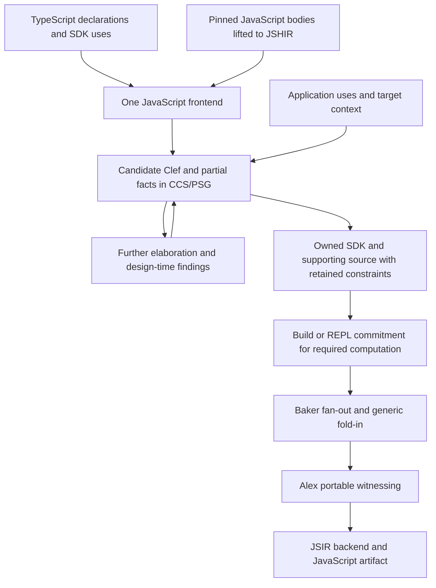

# JavaScript frontend and deferred dependency translation

**Design review: September 2026 — proposed implementation outline and worked example**

A Clef-native SDK can depend on an owned Clef implementation of the JavaScript library behavior it requires. One coordinated foreign-language frontend combines TypeScript declarations and SDK uses with the implementation's parsed structure and available semantic relationships. This example uses JSHIR; [ingestion interfaces and their composition](02_jsir_tooling.md#ingestion-substrate-choice) remain open. Several tools can contribute evidence to that frontend. It contributes candidate Clef, established relationships and unresolved constraints to ordinary CCS/PSG elaboration.

Structure can be recovered before every type or representation is known. Calls, branch relationships, captures, value flow and effect dependencies remain useful as further context arrives. The frontend preserves these facts and the obligations relating JavaScript behavior to candidate Clef; it does not need to finish inference before the candidate can enter the graph.

Witnessing keeps its existing forward meaning. Baker elaborates the required structure through fan-out and generic fold-in; Alex observes the settled PSG through its patterns and elements. The JavaScript backend realizes the portable witnessed operations. Foreign ingestion adds no second witness architecture.

This chapter makes [dependency replacement](05_supply_chain_and_transcribe.md) concrete. The example packages, analysis records and frontend integration are speculative. They are neither existing Cloudflare SDK code nor shipped tool interfaces. Candidate Clef and JavaScript realization sketches describe a result to build and validate; they are not recorded Composer output.

## 1. Relate the required declaration to an implementation

Xantham's structural analysis contributes declarations and contextual constraints. JSHIR contributes the implementation's structured operations, regions, values and references; analysis can establish further control, data, capture and call relationships. Both feed one frontend and ordinary Clef elaboration. A declaration's generics and an unresolved inference variable retain their respective meanings; neither requires an immediate concrete type or runtime representation.

| Generation result | What it supplies | What still executes |
|---|---|---|
| Clef binding declarations | A supported typed API to a host or library | The declared external implementation. |
| Clef binding declarations plus retained JavaScript bodies | A typed boundary and packaged foreign code | The retained JavaScript implementation and its dependencies. |
| Clef declarations and recovered Clef bodies | An owned implementation checked with its consumers | The application, SDK and supporting library compile together. |

For the third result, JSIR supplies the documented JavaScript lift through `source2ast,ast2jsir`. The proposed frontend translates available structure into candidate Clef and carries the declaration/use evidence and correspondence obligations into elaboration. The current [tooling review](02_jsir_tooling.md) establishes no existing JSIR-to-Clef emitter.

Demand identifies which bodies require translation. Their effects, captures and operation semantics can refine the expected contract or expose a conflict. Translation can proceed on established relationships while unresolved ones remain pending. A binding constrains the computation; it does not prove the JavaScript implementation satisfies that constraint.

## 2. Two reachability scopes

Offline recovery is rooted in the SDK surface selected for support. Ordinary application compilation is subsequently rooted in the application's entry points. A supporting library can therefore be recovered once for several SDK operations while each application includes only its reachable portion.



The owned supporting library occupies the compiler-visible dependency role discussed by analogy with Fidelity.Platform. This introduces no requirement to place JavaScript algorithms in Fidelity.Platform itself. Ordinary elaboration resolves the SDK's calls against owned declarations as context becomes available. That call edge must be established for an executable replacement, but a partially resolved library can already participate in analysis.

Reachability closes over required behavior, including module initialization, lexical state, callback targets, dispatch alternatives, imports and observable effects. A textual call graph alone is insufficient. Discovery may require parsing and analyzing more of a package than ultimately receives a Clef implementation.

If a reachable dynamic call cannot be bounded, retain the unresolved target set and its consequences. Unknown is not unreachable. A package's unused export can be excluded only when doing so preserves relevant initialization and behavior. Keep source/IR provenance and reachability justification available to analysis; do not physically destroy graph structure the zipper or later correspondence checks require.

## 3. Example inputs and supported domain

The fictitious `@example/status-sdk` uses `@example/optional-core` to construct synchronous reader functions. The offline scope contains two SDK exports. The example application later uses only `createStatusReader`.

`@example/optional-core/index.d.ts`:

```typescript
export declare function create<T, U>(
  read: () => T | null | undefined,
  project: (value: T) => U,
  fallback: U
): () => U;

export declare function trace(value: unknown): void;
```

`@example/optional-core/index.js`:

```javascript
function choose(value, project, fallback) {
  if (value === null || value === undefined) return fallback;
  return project(value);
}

export function create(read, project, fallback) {
  return () => choose(read(), project, fallback);
}

export function trace(value) {
  console.log(value);
}
```

`@example/status-sdk/index.d.ts`:

```typescript
export declare function createStatusReader(
  read: () => string | null | undefined,
  render: (value: string) => string
): () => string;

export declare function createBadgeReader(
  read: () => string | null | undefined
): () => string;
```

The SDK's resolved executable `index.js`:

```javascript
import { create } from "@example/optional-core";

export function createStatusReader(read, render) {
  return create(read, render, "offline");
}

export function createBadgeReader(read) {
  return create(read, value => value, "pending");
}
```

The worked recovery admits string payloads, synchronous callbacks and repeated invocation of the returned reader. Callbacks may have modeled observable effects, such as advancing an application-owned input sequence. They complete normally in this example; arbitrary foreign throws, reentrant host calls and suspension require additional boundary/effect contracts. This restriction is an explicit example domain, not a deduction from TypeScript's function syntax or a claim to replace every JavaScript use of `create`.

Once the displayed SDK declaration and body evidence have been joined, the example's Clef `read` result can resolve to `Option<string>`. That is an outcome of this context, not a requirement to know the payload at the beginning of translation. A retained foreign callback would need the generated absence, narrowing and failure treatment required by [the JavaScript boundary contract](06_obj_and_null_at_the_boundary.md). The primary executable example uses Clef-owned callbacks; comparison with the original JavaScript uses an explicit relation between their results.

## 4. Accumulate demand and structural evidence

Input capture records package payload digests, declaration providers, executable export conditions, selected SDK roots, host profile and analysis-tool revisions. The example's package names identify fixtures; an implementation must compute actual content identities rather than use those names as proof.

The following rows are proposed analysis artifacts. `D1`, `J1` and subsequent labels are local cross-references for this example, not existing PSG node kinds or diagnostic codes.

| Demand | Declaration and actual use | Constraint carried into recovery |
|---|---|---|
| D1 | SDK `createStatusReader` resolves its imported `create` to the pinned dependency export | Instantiate the declared `T` and `U` as string for this use; result is a zero-argument callable. |
| D2 | First argument is the SDK's `read` parameter | Each invocation produces absence or a string under the admitted callback contract. |
| D3 | Second argument is the SDK's `render` parameter | Project a present string to a string; preserve invocation and effects. |
| D4 | Third argument is the primitive string `"offline"` | Preserve this fallback value and its evaluation at reader creation. |
| D5 | SDK `createBadgeReader` calls the same resolved export | Reuse the supported dependency body with an identity projection and `"pending"`. |

Generic parameter ownership and scope come from the dependency declaration; their applications come from these SDK uses. A matching spelling of `create` in another package contributes no evidence. If the dependency has conditional exports, the body and declaration correspondence is checked for the selected environment.

These rows describe facts once available. They are not an ordering requirement that all rows be resolved before JSHIR structure can enter analysis. If export resolution or a call's type arguments remain open, retain that uncertainty together with independently established body facts.

Both demands reach `create`, its returned function and the private `choose`. Module evaluation creates the declarations but invokes no callback or logger in the displayed module. `trace` and its console call are not reached in this example domain. Adding `trace("loaded")` at module scope changes that conclusion and must invalidate the slice.

Offline recovery produces the supporting function and both SDK operations. Later, an application rooted only at `createStatusReader` can exclude `createBadgeReader` through ordinary Clef reachability. It does not need to translate a JavaScript package again to make that application-level decision.

## 5. Read the required JSHIR regions under that demand

The lift should preserve source locations so declaration/use demands can be related to the function, capture, call and branch regions. The following is a **semantic reading of the expected JSHIR**, not invented JSHIR operation syntax. Actual operation forms and lift coverage must be validated against the pinned tool.

| Region | Operation or relationship exposed by body analysis | Required interpretation |
|---|---|---|
| J1 | `create` returns a function capturing `read`, `project`, `fallback` and its reference to `choose` | Create a callable; do not execute either callback at construction. Resolve the lexical function reference. |
| J2 | The returned function calls `read` with zero arguments | One read per invocation, before the choice is evaluated. |
| J3 | The result is passed to `choose` with the captured projection and fallback | Preserve that value identity and argument evaluation order. |
| J4 | Strict comparisons against null and undefined feed the same branch | Both states select the same absence behavior in this body. |
| J5 | The absence branch returns the captured fallback | No projection call; retain the fallback's value. |
| J6 | The present branch calls `project(value)` | Exactly one one-argument projection call after the read, with the present value. |
| J7 | No writes replace the captured bindings or `choose` in this slice | Stable lexical bindings; effects inside callbacks remain separate and are not inferred pure. |

The first useful translation pattern is consequently small: a nullish choice under a returned closure. Its match identifies candidate structure and obligations. Captures and callback effects contribute further relationships; their unresolved parts do not prevent the established branch and call structure from participating in elaboration.

### A partial elaboration trace

The symbols `tau` and `rho` below stand for inference variables of one use. They are explanatory notation, not proposed Clef syntax, runtime types or synonyms for `JsValue`. The dependency's declared `T` and `U` remain generic parameters with their own scopes.

| Context available | Facts the graph can retain | What remains open |
|---|---|---|
| Dependency body and its generic declaration | A returned callable captures `read`, `project` and `fallback`; each invocation reads once; the present branch projects once. The use relates read payload `tau`, projection `tau -> rho`, fallback `rho` and result `rho`. | This use's payload/result resolution, callback effects and realization. |
| Nullish branch correspondence | Null and undefined share the absence path; an Option-shaped candidate can relate the present payload to `tau`. | The payload's concrete structure and the Option representation. |
| Displayed SDK declarations and call arguments | Applicable string constraints refine `tau` and `rho`; the source can be presented as the string instance below. | Actual caller effect/capture requirements, foreign admission where applicable, and target-dependent choices. |
| An application supplies callers | Their identities and behavior refine the invocation, capture and failure obligations; reachable uses determine which parts are needed. | Any remaining premises required by the selected build or REPL computation. |
| Required computation is committed | Establish its callable forms, boundary checks, representation and correspondence obligations for execution. | Other consistently partial project work can remain open. |

Facts can arrive in another order and trigger refinement of the same graph. The frontend need not synthesize explicit type annotations for every expression. A known contradiction is a diagnostic; an unknown payload or missing target context remains a pending constraint. A value deliberately used only through an opaque foreign contract may remain opaque even in the committed computation.

## 6. Instantiate a correspondence, then check its premises

For this example, define the input relation:

```text
JavaScript null or undefined  ~  Clef None
JavaScript string s           ~  Clef Some s
```

The body never distinguishes null from undefined after that choice. Empty string remains present. This permits the particular Option reconstruction. A dependency that distinguishes the two absence states needs the generated union specified for that boundary; the translator must not reuse this correspondence unchanged.

The translation pattern relates `J1–J7` and available demands `D1–D5` to a Clef closure and Option match. Its proposed obligation record contains: source and IR anchors, declaration ownership or unresolved ownership constraints, use-site inference relationships, candidate Clef nodes, preserved observations, premises, evidence status and invalidation dependencies. It contains no executable emission directive or generated Alex witness.

Obligations arise as the relationships become known and remain attached while elaboration continues. The table describes what is needed to accept the relevant executable instance, not what must be proved before a partial candidate can enter the PSG.

| Obligation | Evidence required in this example |
|---|---|
| Declaration/body identity | Pinned resolution from each SDK call to the exact dependency export and body. |
| Payload admission | String results or the two admitted absence states; native callback contracts or actual foreign-boundary establishment. |
| Absence equivalence | J4 and J5 make the same observation of null and undefined; both SDK uses accept that behavior. |
| Factory evaluation | Evaluate the supplied arguments once; create a callable without invoking either callback. |
| Invocation trace | Every returned-reader call invokes `read` once; only a present result invokes `project`, once and afterward. |
| Capture and state | Capture the callable values and fallback at construction. Preserve state those callbacks themselves share; do not snapshot their mutable environments. |
| Calling convention | Preserve zero-argument read and one-argument projection invocation, including any admitted receiver behavior at a retained boundary. |
| Failure and suspension domain | The main example's normal synchronous completion premise is established for its callers; an unknown foreign callback cannot silently inherit it. |
| Slice completeness | Include the lexical `choose`, initialization and effects required by the selected calls. Justify exclusion of `trace`. |
| Forward support | Candidate types and expressions have supported CCS elaboration, Baker patterns and Alex portable witnessing, followed by an admitted JSIR realization. |

A compact behavioral relation makes the result checkable. Related read callbacks produce related outcomes and the same admitted effect trace; related project callbacks preserve the payload/result relation and their admitted trace. Then:

- Construction invokes neither callback.
- An absent read returns the related fallback after the read's effects.
- A present read invokes the related projection once, after the read, and returns its result.
- Repeated reader calls preserve the relation between callback states and resulting traces.

The argument is conditional on those callback relationships. They must be checked for owned callers or supplied by an explicit permitted boundary contract. Type-checking the reconstructed function alone does not prove them, and unknown callback effects are not erased.

## 7. Produce the supporting Clef library and redirect the SDK

One candidate source presentation is shown below after the displayed SDK uses have supplied their string constraints. The annotations make that instance readable; they are not mandatory frontend output or evidence that payload types were resolved before ingestion. Ordinary elaboration may retain a generic implementation where its contract supports one. An executable claim for additional types still requires the corresponding behavior and boundary obligations.

`Recovered.OptionalCore.clef` — proposed owned library source:

```clef
module Recovered.OptionalCore

let choose
    (value: Option<string>)
    (project: string -> string)
    (fallback: string) : string =
    match value with
    | None -> fallback
    | Some present -> project present

let create
    (read: unit -> Option<string>)
    (project: string -> string)
    (fallback: string) : unit -> string =
    fun () -> choose (read ()) project fallback
```

`ClefStatusSdk.clef` — proposed SDK source calling the owned declaration:

```clef
module ClefStatusSdk

let createStatusReader
    (read: unit -> Option<string>)
    (render: string -> string) : unit -> string =
    Recovered.OptionalCore.create read render "offline"

let createBadgeReader
    (read: unit -> Option<string>) : unit -> string =
    Recovered.OptionalCore.create read (fun value -> value) "pending"
```

These are ordinary Clef functions, not binding annotations instructing emission to insert the original JavaScript. Source correspondence records connect their declarations and bodies back to the accepted recovery; remaining genuine host calls would still use explicit bindings.

The ownership change is material:

```text
Before: application -> JavaScript SDK body -> npm dependency create
After:  application -> ClefStatusSdk -> Recovered.OptionalCore
```

Generating the supporting module while leaving the SDK import unchanged would fail the replacement claim. It is the SDK's resolved call edge, as well as the dependency body, that must change. Specialization also limits the supporting library's accepted API. A new SDK use first elaborates against the retained source and constraints; a previously unaccepted instantiation may need further representation or behavior obligations. Translation extends only when the use requires foreign behavior not yet represented. The [incremental lifecycle](05_supply_chain_and_transcribe.md#incremental-library-lifecycle) preserves the completed conversion work.

An unresolved payload retains its inference relationships; it is not automatically emitted as `JsValue`. If the established contract instead admits an opaque foreign payload, it may remain `JsValue` through declared crossings without recovering its fields. That does not supply the implementation of an unknown foreign operation or remove a retained runtime dependency by itself.

### Refinement is an intended benefit

The owned source becomes available for the same functional refinement and graph analysis as authored Clef. Property-bag choices can become records or unions when their meaning is established; nullable control flow can become Option structure; callback plumbing can become functions with explicit capture relationships. The SDK can expose a Clef-native API while adapters preserve required foreign contracts.

In this example the graph can expose the dependency's choice and the SDK's call together, preserve the conditional projection, and eliminate unused wrapper structure where justified. It can retain a reusable generic function rather than duplicate specializations when the accumulated constraints support that result. The foreign source's organization does not fix the emitted JavaScript's structure.

The boundary data contract and required functionality govern these refinements, including observable evaluation, identity, effects and failure behavior. Deferred constraints preserve room for a better structure as more context arrives. Each refinement carries the correspondence obligations affected by its changes through ordinary elaboration and lowering.

## 8. Coordinate demand and implementation evidence

The following algorithm describes required work and records, not new compiler pass names or a settled on-disk schema:

1. **Capture inputs and available identities.** Pin source payloads and record known SDK roots, resolution conditions and target context. Resolve what the evidence supports; retain unresolved exports, uses and target choices. A pending export must not become a same-name match or block unrelated structural analysis.
2. **Expand the behavioral slice.** Follow demanded bodies, initialization, captures, shared-state access and known calls. Track callback requirements and unknown targets. Analyze recursive groups together; use terminating conservative summaries and report analysis limits rather than omitting unresolved edges.
3. **Contribute structure to ordinary elaboration.** Translate each available JSHIR region under known demand constraints. Compose supported translation patterns and preserve the relation between foreign bindings, represented values and candidate Clef nodes. Candidate source and partial evidence enter CCS before every type or representation is resolved.
4. **Join and refine continuously.** Relate foreign semantic evidence to the candidate's PSG constraints. Refine type, effect, capture and boundary decisions as context arrives; invalidate facts when their dependencies change. Candidate changes also require affected correspondence obligations to be reconsidered.
5. **Discharge or expose as evidence permits.** Instantiate preservation obligations, distinguishing checked evidence, permitted host assumptions, generated runtime predicates and pending requirements. Report known contradictions and established unsupported shapes; retain open choices. Atelier presents findings and requests only residual intent or contracts the analysis cannot supply.
6. **Retain owned source and its constraints.** Record source, provenance, generic contracts, assumptions, evidence and pending obligations. Resolve the SDK implementation edge to the supporting source as justified. Keeping source under elaboration does not claim every possible instantiation executable; retained foreign edges remain explicit.
7. **Commit the demanded computation.** Build or REPL evaluation selects the required reachable graph. Discharge the obligations needed for that commitment, including translation correspondence and forward rule coverage, or diagnose the located remaining requirement. Saturate and witness that computation through the existing pathway. Unused partial work is not a demand to concretize every imported value.

These steps cooperate during elaboration rather than form an eager sequence of completed typing gates. A small initial set of translation patterns can cover literals, lexical calls, nullish choice and returned closures. Each pattern carries its input relation, candidate structure, preserved observations, pending premises and failure conditions. Composition preserves shared identities and effect order. Missing JavaScript types leave inference work; they do not erase the existing program structure.

The exact adapter from foreign semantic findings into CCS evidence is implementation design still to complete. Its contract is constrained here: preserve provenance and inference relationships, express obligations in the existing semantic machinery, and leave the resulting PSG as the authority for Clef. The frontend must not fabricate settled coeffects or make Atelier an alternative type checker. Partial analysis records do not introduce a new source-language hole syntax or an executable JavaScript escape hatch.

### Combined contributions to this fixture

The [tooling contribution map](02_jsir_tooling.md#contributions-to-a-fused-pipeline) can be exercised on this example through the following proposed integration. This specifies inspectable relationships, not existing adapters or a requirement to run every tool.

| Contributing material | Mechanical use in this example | Shared record or obligation affected |
|---|---|---|
| Xantham/TypeScript declarations and SDK uses | Relate the two SDK calls to the dependency's generic declaration; retain each use's payload/result constraints. | D1–D5 ownership and instantiation relationships, including pending resolution. |
| Bun's syntax, symbol, scope and import/part relationships | Trace the lexical `choose`, returned function, captured bindings, read call and strict comparisons. Retain initialization dependencies and distinguish source structure from parser rewrites. | J1–J7 correspondence anchors, capture/value identities and the behavioral slice. These facts still need the relevant analysis; symbol-use estimates do not prove callback multiplicity. |
| JSHIR operations and regions | Represent the required calls and branches for further analysis, whether lifted through the reviewed Babel route or supplied by a separately validated adapter. Relate them to the same source and candidate identities. | The same J1–J7 observations and affected transformation obligations. A second view supplements existing evidence rather than creating duplicate semantic owners. |
| Dafny's specification and compilation examples | Formulate the callback-state/result relation and construction/invocation traces; use function/application and datatype cases to scrutinize the Option/closure candidate and eventual JS realization. | Factory evaluation, absence equivalence, callback order and state-sharing obligations from section 6. A reference model or checker would be an additional explicit implementation, not assumed tooling. |
| F#/Fable executable reference | Implement the same reader contract in F#, compile through Fable, and exercise related absent/present inputs and stateful callbacks. Compare its results and traces with the original JavaScript and, as available, the Clef-generated artifact. | Executable cases for construction without callback invocation, one read per invocation, conditional projection and repeated/shared callback state. This reference fixture is proposed, not an existing three-way test result. |
| Combined elaboration and preservation checks | Join available relationships, refine `tau`/`rho` as SDK context arrives, retain open callback effects, and apply justified functional refinements. Check the final emitted behavior against the same relation. | One candidate PSG, its dependent obligations, the owned library edge and the artifact acceptance record. |

For example, initially ingesting the returned function establishes useful structure while `tau` and `rho` remain open. The strict nullish branch supplies the proposed absence relation. The callback-state contract supplies the conditions under which the functional replacement preserves each invocation. Later SDK string constraints refine that existing candidate; Baker and Alex consume the structure settled for commitment, and JSIR realizes it below the witness boundary.

The Fable reference uses its own Option/callback representation; comparison adapters relate it to the admitted original JavaScript and Clef inputs without collapsing additional absence distinctions. The [oracle procedure](07_dependency_identity_and_validation.md#ffable-as-an-executable-oracle) governs state initialization, provenance and trace comparison. These cases can exist before the Clef backend is ready, supporting incremental delivery against a stable behavioral reference.

Changing the source to distinguish null from undefined must invalidate both the Option correspondence and tests derived from it, whichever adapter first observes the change. Adding a module-level log must update the behavioral slice even if a bundler reports an exported function unused. Rewriting callback invocation during emission must be checked against the same trace relation. These are shared obligations spanning ingestion, refinement and output; a project's strongest initial contribution does not confine its usefulness to one stage.

## 9. Forward witnessing remains unchanged

CCS checks the owned source and its actual callers. Baker's fan-out composes recipes from Ingredients; generic fold-in incorporates the resulting structure. The returned callable has settled captures and application boundaries in the PSG. The Option branch retains its conditional projection and ordinary evaluation semantics.

Alex observes that settled graph through Library of Alexandria patterns and elements using the Huet-style zipper over the joint constraints. It emits `func`, `scf`, `arith`, `memref` and `index`. It does not match the names `create`, `choose` or either example package to select custom code generation.

The JavaScript backend realizes these portable operations and uses retained codata where necessary. Under the Option specification's established no-collision condition for string payloads, an erased Option can use undefined for None. A possible JavaScript shape for the reachable SDK function is then:

```javascript
export function createStatusReader(read, render) {
  return () => {
    const value = read();
    return value === undefined ? "offline" : render(value);
  };
}
```

This illustrative function assumes **Clef-interior callback conventions**: `read` supplies the admitted Option realization. It is not a drop-in foreign entry accepting arbitrary JavaScript nulls and unchecked callback results. Such an export needs its boundary adapters and failure contract. The backend's actual output need not have this shape; it must preserve the accepted observations.

JSHIR/JSIR is the backend realization below Alex in this forward route. The foreign JSHIR used during ingestion is analysis input, not a semantic dialect inserted above the witness boundary. Successful lifting, candidate type-checking and final JavaScript parsing are three different checks; none alone establishes the full correspondence.

## 10. Inspectable artifacts and acceptance

The toolchain must retain the following information across sessions and builds so later work continues incrementally. Analyses can transport it in memory and reconstruct derived indices from retained source and metadata; that does not require repeating foreign conversion. These are required artifact roles; their serialization and command-line exposure are not claimed implemented.

| Artifact | Minimum inspectable content |
|---|---|
| Input manifest | Payload identities, declaration/runtime resolution, export conditions, tools, host and supported SDK roots. |
| Demand/slice relation | D1–D5-style use constraints, reached regions and justified exclusions, initialization and unresolved targets. |
| Translation correspondence | J1–J7-style body facts, candidate source nodes, inference relationships, selected patterns, premises and preserved observations. |
| Obligation findings | Established, pending and refuted requirements; assumptions/checks kept distinct; related source locations and invalidation dependencies. |
| Owned library and SDK source | Candidate or accepted source, generic contracts, retained constraints, explicit foreign edges and the SDK dependency relation. Executable acceptance is stated for a particular commitment. |
| Compilation evidence | Application reachability, settled captures and Option structure, Baker recipes/fold-in, portable witnessing and target realization. |
| Acceptance record | Behavioral cases, negative mutations, dependency closure, emitted artifact identity and selected host execution. |

Acceptance first needs elaboration cases that detect premature commitment:

- Ingest the closure and nullish choice before resolving the payload and result of a use; retain their relationships and pending choices without substituting `JsValue`.
- Add the SDK string constraints later and refine the existing candidate without losing source identity, captures or correspondence obligations.
- Leave target-dependent representation pending while displaying known structure; commit only when the relevant build or REPL computation needs it.
- Keep a deliberately opaque foreign value opaque through admitted calls, without requiring its complete shape to execute those calls.
- Introduce a known contradiction and report it promptly; distinguish it from an open inference variable or pending rule-coverage question.

The worked example also has a small, finite set of observable cases suitable for an executable fixture once the required facts settle. Compare original dependency behavior with the generated artifact under the stated input/callback relation:

| Case | Expected result and trace |
|---|---|
| Reader construction | No read or projection call. |
| Read returns undefined or null | Related Clef read returns None; result `"offline"`; read once, projection never. |
| Read returns empty string | Related read returns Some empty string; projection runs once. Truthiness-based recovery would fail. |
| Read returns `"ready"` | Projection receives that value once, after the read; its result is returned. |
| Two reader invocations | Two reads, each with its own conditional projection; no memoization of the first outcome. |
| Stateful read or projection | Preserve declared callback state and effect order across invocations and across readers sharing those callbacks. |
| Application uses only status reader | Recovered badge source may exist, but its unused entry is absent from the application artifact where ordinary reachability permits. No vendor SDK or optional-core executable remains. |

Add mutations that falsify one premise at a time:

- Change the strict nullish branch to a truthiness test: empty string now takes a different path; the original Option correspondence must fail or be revised.
- Add a separate null branch: preserve the declared distinction with an appropriate contract; do not merge it into None silently.
- Call `read` during construction, call it twice, or retain the first result: the invocation/capture correspondence changes.
- Add a top-level log or another module initializer effect: it becomes part of the required behavior even though the exported `trace` function was previously unused.
- Replace a known call with unresolved dynamic dispatch: report the unknown target and dependent recovery obligation.
- Admit a throwing foreign callback: require the boundary Result/error mapping and its behavioral correspondence; the main example's normal-completion premise no longer holds.
- Introduce an object projection whose fields may be getters or shared mutable state: obtain the relevant property/effect evidence; a TypeScript shape is insufficient.

For the future backend fixture, run the emitted JavaScript under the selected host profile and bind the results to its artifact and tool revisions. A dependency-free claim checks bundled implementations as well as import statements. The original vendor code may be used as an offline characterization oracle without being included in the deployed artifact.

Numeric operations added to a recovered body inherit [numeric selection and precision obligations](08_numeric_selection_and_precision.md): `number` is not evidence of integer exactness, units or permitted regrouping. Byte-backed or durable state inherits the BAREWire and recovery obligations in [deployment contexts](03_four_wings.md). These extend the same contract-directed procedure when demanded; they are not prerequisites to invent for this small reader example.

## 11. Integration decisions still to make

The next implementation design must settle the frontend evidence adapter, source/IR/candidate identity persistence, translation-pattern contracts and their correspondence checking, incremental constraint refinement, and the regeneration interface. That interface must reconcile changes with retained source and invalidate affected evidence according to the incremental lifecycle; ordinary application builds do not restart dependency conversion. The pinned JSHIR lift/emission coverage must be exercised for the chosen fixtures. Library packaging must preserve the owned SDK-to-dependency edge and the constraints needed by normal compilation.

Evaluate TypeScript Compiler API, Bun and JSHIR contributions individually and in useful combinations against the same structural and partial-inference cases. Use Dafny's semantic and realization cases to strengthen the recovery obligations and acceptance checks; evaluate any direct tool reuse explicitly. The J1–J7 labels describe relationships needed by the example, not a requirement that every frontend use MLIR. Retaining JSIR for forward generation does not require using it to parse the foreign source.

These are concrete interfaces and proof obligations to implement, not permission to choose an undocumented alternate pipeline. [Atelier's Transcribe design](../../../Atelier/docs/10_transcribe.md) remains the design-time presentation and curation surface; [binding generation](04_sdk_describes_runtime.md) supplies supported declarations; [identity and acceptance](07_dependency_identity_and_validation.md) governs provenance and the final support claim.
