# Stage 5 → manual Codex Desktop specification

Effective 2026-09-16, human acceptance no longer starts the Grok VM specification worker.
The canonical Stage Approval workflow records the decision and a copyable Stage 6–9
prompt in the same GitHub issue comment, sets Spec Needed, and sends the prompt to Slack.
The Owner submits the prompt in a new Codex Desktop task using `duumbi-spec-desktop`.
No automatic Codex task, model call, scheduled spec run or Stage 10 follows acceptance.

```mermaid
flowchart LR
  A[Stage 5 Human Accept] --> B[GitHub decision comment + Desktop prompt]
  B --> C[One Slack prompt message]
  C --> D[Owner submits prompt in Codex Desktop]
  D --> E[Stage 6 product spec and decomposition]
  E --> F[Stage 7 product review]
  F --> G[Stage 8 technical spec]
  G --> H[Stage 9 implementability review]
  H --> I[Spec-only PR for Owner review and merge]
```



## Notification contract

Both Slack-button acceptance and manual workflow dispatch use `stage-approval.yml`.
The persisted GitHub prompt and Slack prompt share the same source string. A Stage 5
Accept sends one prompt to the configured review channel; when channel credentials are
absent it uses the Slack button response URL if available. It does not post the same
handoff to both destinations. No `DUUMBI_SPEC_EVENT_V1` is emitted. Reject/clarification
retain their existing behavior and never include a specification prompt.

New Accept decisions remove the retired `spec-automation` label so it cannot suppress
manual Stage 7/9 review notifications. For already accepted issues, remove that label
only after disabling the old worker and confirming no concurrent spec run is active.

The decision ID remains the GitHub decision comment ID for audit; it is no longer an
automatic spec-job key. The prompt tells Desktop to read the latest acceptance and revised
Owner rationale. Duplicate historical acceptance retries do not start work or post again
once the issue has advanced. Slack is transport: if delivery fails, the GitHub decision
comment still contains the prompt. Do not re-accept merely to retrieve it.

## Retire the Grok deployment

The repository change cannot disable routines saved in the Grok service. Disable/remove
all three Duumbi Spec routines before using the Desktop path:

- Spec enqueue from Stage 5 Slack
- Spec queue drain (including its five-minute schedule)
- Spec finalize on merged codex/spec PR

Disable/remove the saved DUUMBI specification worker skill and retire the Duumbi Spec
bot. Verify there is no active worker before editing the same issue from Desktop.
Preserve `/workspace/duumbi-spec-state`, recovery logs, research and branch commits as
historical evidence. Do not run drain/continue/finalize for pending legacy events.
The old runner and its tests remain in the repository for historical recovery analysis;
they are not part of the supported Stage 5 execution path. The legacy setup/routine
recipes are explicitly marked retired and must not be reinstalled.

## Existing accepted issues, including #817

Acceptance is not invalidated by switching execution transport. Use the latest actual
Stage 5 decision and start a Desktop specification task; do not create a new decision or
rerun acceptance only to obtain the updated prompt. Preserve research source URLs and
retrieval dates in material accessible to Desktop (an issue comment, repo document or
attached/exported evidence). A VM-local path alone is not transferable evidence.

For #817, the latest acceptance at migration is decision 5704193547. Verify it remains
current when starting. Earlier worker review verdicts are historical; Desktop reviews the
specification against the current acceptance. Existing branches should be inspected and
reused or archived deliberately; no blanket branch/checkpoint deletion is required.

Example manual prompt for an already accepted issue:

```text
Use duumbi-spec-desktop for Stage 6–9 specification in this Codex Desktop task.
Target issue: https://github.com/hgahub/duumbi/issues/817
Read the latest Stage 5 Accept and revised Owner conditions, current source and available
research. Prepare and review PRODUCT.md and TECHNICAL.md in a spec-only PR.
Resolve product questions directly with me here. Preserve prior evidence.
Do not invoke the retired Grok worker, merge, or start implementation/Stage 10.
```
